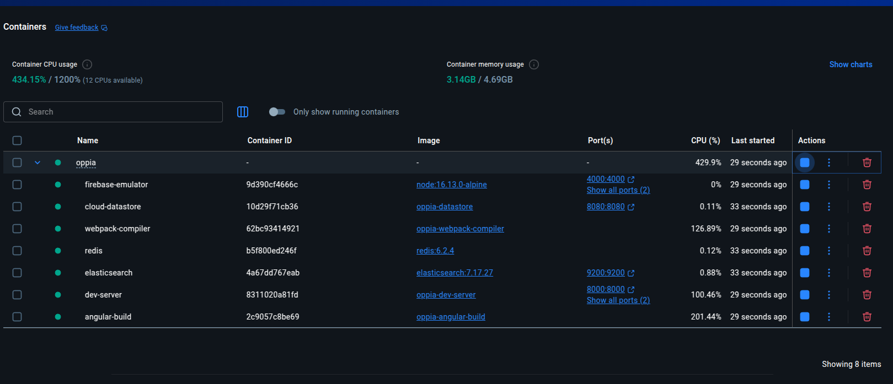

# Diário de Bordo – \[Bianca Patrocínio Castro]

**Disciplina:** \[Gestão da Configuração e Evolução de Software]
**Equipe:** \[Oppia]
**Comunidade/Projeto de Software Livre:** \[Oppia]

---

## Sprint 1 – \[11/08 – 24/09]

### Resumo da Sprint

Essa sprint foi focada na familiarização com o projeto, a entrada na comunidade, o aprendizado do fluxo de contribuições e a configuração do ambiente.

### Atividades Realizadas

| Data  | Atividade | Tipo (Código/Doc/Discussão/Outro) | Link/Referência | Status |
| ----- | --------- | --------------------------------- | --------------- | ------ |
| 21/09 | Rodei o projeto via Docker | Código |  [Link](https://github.com/oppia/oppia/wiki/Installing-Oppia-using-Docker) | Concluído |
| 15/09 | Mapeamento de site de Documentação e fluxo de trabalho | Estudo | [Link](https://github.com/oppia/oppia/wiki/Rules-for-making-PRs) | Concluído |
| 24/09 | Criação de discursão sobre problema ao tentar rodar via Docker| Discussão | [Link](https://github.com/oppia/oppia/discussions/23454) | Concluído |
| 20/09 | Avaliando a primeira Issue para trabalhar| Estudo | - | Em andamento |

### Maiores Avanços

* Achei o link onde fica mais fácil de buscar issues e ver qual Issue está priorizada: [Link](https://github.com/orgs/oppia/projects/3/views/10)

* Consegui configurar instalação na minha máquina.

* Estudei as políticas de Pull Requests (PRs) e estou estudando para poder pegar a primeira contribuição.

* Após ter conseguido rodar na minha máquina fiz um relato na Wiki de Q&A (Installation), para caso alguém possua um problema parecido irá ter documentado a resolução: [Link](https://github.com/oppia/oppia/discussions/23454) 

Containers do Docker rodando:

### Maiores Dificuldades

* Passei muito tempo tentando rodar o projeto, isso me atrasoi bastante em relação ao que eu tinha idealizado para a Sprint 1. Tentei rodar no Windowws, no Mac, via Linux e fui conseguir rodar por Linux via Docker.

* Como o projeto é bastante grande, tive uma certa dificuldade de achar alguns links, tem que procurar em mais de um repositório para identificar 

### Aprendizados

* Aprendi mais sobre como funciona a configuração do Docker e como impacta na hora de rodar.

* Fiz uma boa análise no repositório e até irei utilizar ele na matéria de Qualidade de Software.

### Plano Pessoal para a Próxima Sprint
* [ ] Buscar good-first issues para serem realizadas.
* [ ] Me aprofundar nos padrões do projeto.
* [ ] Abrir a minha primeira Issue.