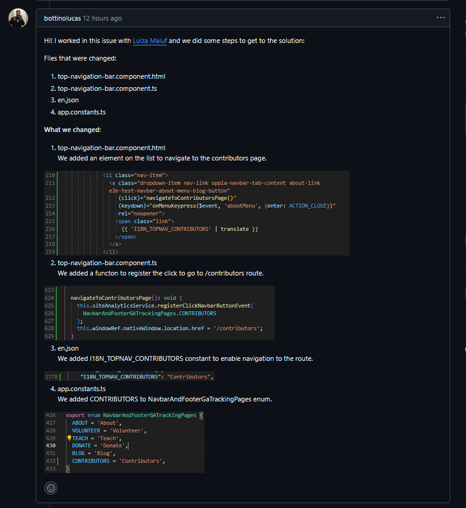

# Diário de Bordo – \[Luiza Maluf Amorim]

**Disciplina:** \[Gestão da Configuração e Evolução de Software]
**Equipe:** \[Oppia]
**Comunidade/Projeto de Software Livre:** \[Oppia]

---

## Sprint 1 – \[10/09 – 24/09]

### Resumo da Sprint

Essa sprint foi dedicada à contribuição efetiva no código da comunidade Oppia. Em conjunto com meu colega Lucas Bottino, trabalhamos na issue [#22915](https://github.com/oppia/oppia/issues/22915), que consistia em adicionar um link para a página de Contributors no menu suspenso About da barra de navegação superior.

O trabalho envolveu identificar os arquivos responsáveis pelo componente de navegação, realizar as alterações necessárias, validar a solução localmente e preparar a submissão do PR.

### Atividades Realizadas

| Data           | Atividade                                  | Tipo (Código/Doc/Discussão/Outro) | Link/Referência | Status        |
| -------------- | ------------------------------------------ | --------------------------------- | --------------- | ------------- |
| 15/09          | Estudo da issue e histórico de PRs relacionados | Estudo | [Issue #22915](https://github.com/oppia/oppia/issues/22915) | Concluído     |
| 23/09          | Identificação dos arquivos relevantes para a alteração | Código | `top-navigation-bar.component.html`, `top-navigation-bar.component.ts` | Concluído     |
| 23/09          | Implementação da adição do link no menu    | Código | - | Concluído     |
| 23/09          | Inclusão de suporte a i18n e constantes    | Código | `en.json`, `app.constants.ts` | Concluído     |
| 04/10          | Testes locais da navegação                 | Código | - | Incompleto    |
| 23/10 - 24/10  | Discussão e interação com o maintainer @mon4our | Discussão | [Issue #22915](https://github.com/oppia/oppia/issues/22915) | Em andamento  |
| 24/10          | Assigne da issue para subir o PR           | Outro | Aguardando maintainer | Pendente      |

### Maiores Avanços

* Conseguimos implementar a feature de forma limpa e alinhada com a issue.  
* Identificamos rapidamente os arquivos certos a modificar graças ao estudo do PR anterior (#22560).  
* Trabalhamos em colaboração para dividir tarefas e revisar mutuamente o código.  

### Maiores Dificuldades

* Foi necessário entender o fluxo de internacionalização (i18n) do Oppia para inserir a nova chave.  
* A navegação exigiu atualização também no **tracking de GA**, o que não estava descrito na issue.  
* Dependência da validação dos maintainers para confirmar se a solução segue o padrão esperado.  

### Aprendizados

* Ganhamos experiência em **trabalhar com componentes Angular** dentro de um projeto grande como o Oppia.  
* Entendemos melhor o processo de contribuição e interação com maintainers (apresentar mudanças, aguardar validação e fornecer evidências).  
* Aprendi a importância de manter a consistência entre o **footer** e o **top navigation bar** em termos de UX.  

### Plano Pessoal para a Próxima Sprint

* [ ] Finalizar a submissão do PR com o vídeo de demonstração solicitado.  
* [ ] Explorar novas issues relacionadas à **CI/CD** e **testes automatizados** no Oppia.   