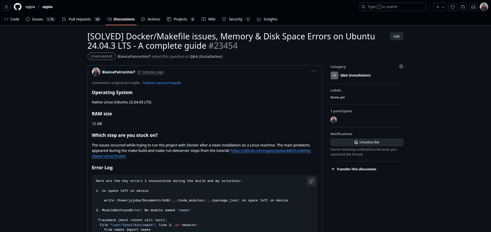
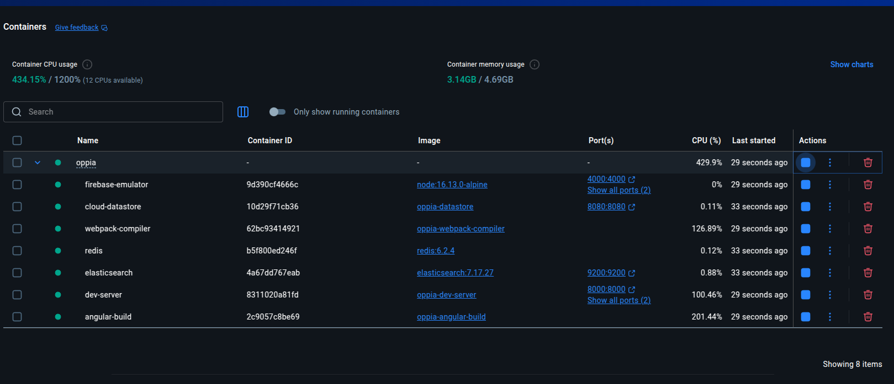
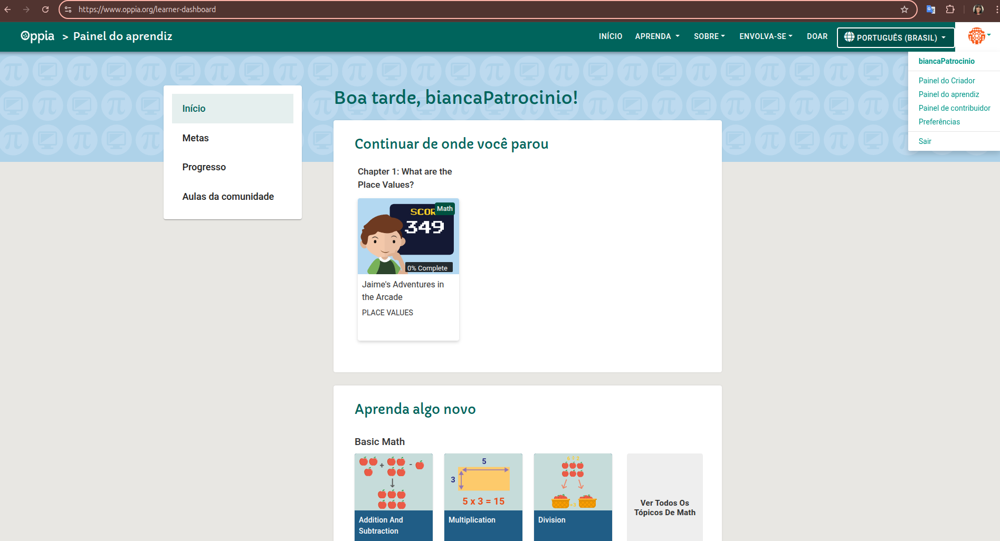
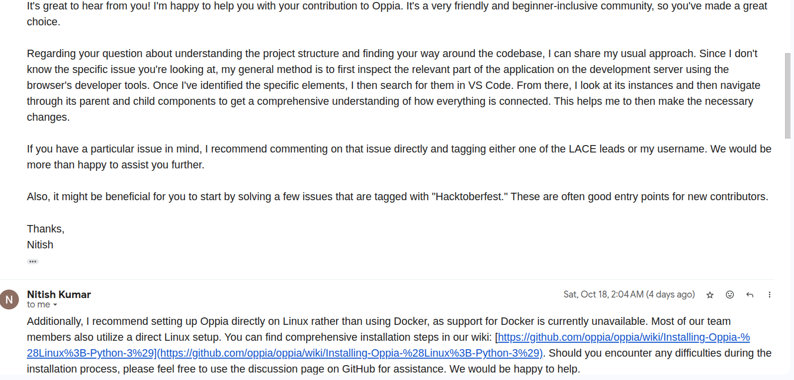
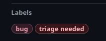
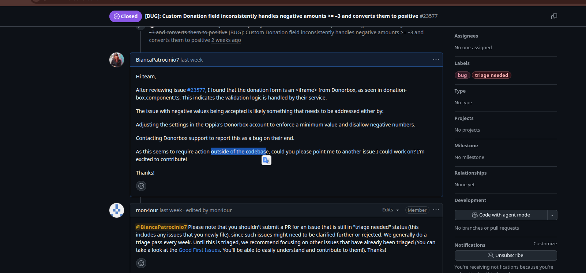
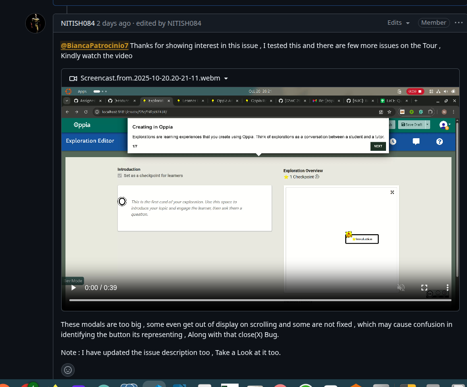

# Diário de Bordo – \[Bianca Patrocínio Castro]

**Disciplina:** \[Gestão da Configuração e Evolução de Software]
**Equipe:** \[Oppia]
**Comunidade/Projeto de Software Livre:** \[Oppia]

---

## Sprint 0 - \[25/08 – 10/09]

### Resumo da Sprint

Neste sprint fiquei focada em conseguir rodar o projeto, onde na Sprint 0 não foi possivel em minha máquina. Além disso procurei entender melhor como funcionar o fluxo de trabalho e links importante para usar como orientação.

### Atividades Realizadas

| Data  | Atividade | Tipo (Código/Doc/Discussão/Outro) | Link/Referência | Status |
| ----- | --------- | --------------------------------- | --------------- | ------ |
| 05/09 | Assinatura do CLA individual | Formulário |  [Link](https://goo.gl/forms/AttNH80OV0) | Concluído |
| 07/09 | Preenchimento do formulário de contribuição | Formulário |  [Link](https://goo.gl/forms/otv30JV3Ihv0dT3C3) | Concluído |
| 10/09 | Apresentação no GitHub discussions | Comentário |  [Link](https://github.com/oppia/oppia/discussions/16715#discussioncomment-14363592) | Concluído |
| 06/09 | Exploração da plataforma | Estudo |  [Link](https://www.oppia.org/) | Concluído |
| 06/09 | Criação do fork | Código | [Link](https://github.com/BiancaPatrocinio7/oppia) | Concluído |
| 09/09 | Configuração do ambiente linux | Código | [Link](https://github.com/oppia/oppia/wiki/Installing-Oppia-%28Linux%3B-Python-3%29)   | Com problemas |
| 10/09 | Mapeamento das políticas para PRs | Estudo | [Link](https://github.com/oppia/oppia/wiki/Rules-for-making-PRs) | Concluído |
| 10/09 | Criação do relatório de contribuição individual | Doc | - | Concluído |

### Maiores Avanços

* Preenchi os formulários necessários e me apresentei no GitHub Discussions. 

* Consegui configurar minha máquina.

* Estudei as políticas de Pull Requests (PRs) e estou estudano para poder pegar a primeira contribuição.

### Maiores Dificuldades

* Não consegui rodar localmente, está dando problema de arquivo não encontrado, estou vendo a possibilidade de refazer mais uma vez a instalação.

* Não consegui instalar via docker.

* Entender o filtro das Issues, há muitas antigas e não sei se já foram resolvidas.

### Aprendizados

* Experiência com ambiente virtual de um projeto grande.

* Achei legal os formulários e a integração com o email.

* Super bacana a documentação, muito importante ter ela disponível.

* Aprendi um pouco mais como funciona um projeto open source com contribuições globais.

### Plano Pessoal para a Próxima Sprint

* [ ] Resolver o problema e rodar localmente.
* [ ] Buscar good-first issues para serem realizadas.
* [ ] Me aprofundar nos padrões do projeto.

## Sprint 1 – \[11/08 – 24/09]

### Resumo da Sprint

Essa sprint foi focada na familiarização com o projeto, a entrada na comunidade, o aprendizado do fluxo de contribuições e a configuração do ambiente.

### Atividades Realizadas

| Data  | Atividade | Tipo (Código/Doc/Discussão/Outro) | Link/Referência | Status |
| ----- | --------- | --------------------------------- | --------------- | ------ |
| 21/09 | Rodei o projeto via Docker | Código |  [Link](https://github.com/oppia/oppia/wiki/Installing-Oppia-using-Docker) | Concluído |
| 15/09 | Mapeamento de site de Documentação e fluxo de trabalho | Estudo | [Link](https://github.com/oppia/oppia/wiki/Rules-for-making-PRs) | Concluído |
| 24/09 | Criação de discursão sobre problema ao tentar rodar via Docker| Discussão | [Link](https://github.com/oppia/oppia/discussions/23454) | Concluído |
| 20/09 | Avaliando a primeira Issue para trabalhar| Estudo | - | Em andamento |

### Maiores Avanços

* Achei o link onde fica mais fácil de buscar issues e ver qual Issue está priorizada: [Link](https://github.com/orgs/oppia/projects/3/views/10)

* Consegui configurar instalação na minha máquina.

* Estudei as políticas de Pull Requests (PRs) e estou estudando para poder pegar a primeira contribuição.

* Após ter conseguido rodar na minha máquina fiz um relato na Wiki de Q&A (Installation), para caso alguém possua um problema parecido irá ter documentado a resolução: [Link](https://github.com/oppia/oppia/discussions/23454) 

Containers do Docker rodando:

### Maiores Dificuldades

* Passei muito tempo tentando rodar o projeto, isso me atrasoi bastante em relação ao que eu tinha idealizado para a Sprint 1. Tentei rodar no Windows, no Mac, via Linux e fui conseguir rodar por Linux via Docker.

* Como o projeto é bastante grande, tive uma certa dificuldade de achar alguns links, tem que procurar em mais de um repositório para identificar 

### Aprendizados

* Aprendi mais sobre como funciona a configuração do Docker e como impacta na hora de rodar.

* Fiz uma boa análise no repositório e até irei utilizar ele na matéria de Qualidade de Software.

### Plano Pessoal para a Próxima Sprint
* [ ] Buscar good-first issues para serem realizadas.
* [ ] Me aprofundar nos padrões do projeto.
* [ ] Abrir a minha primeira Issue.

## Sprint 2 – \[25/09 – 08/10]

### Resumo da Sprint

Essa sprint foi focada em entender sobre o código, ler documentação e navegar pelo site.

### Atividades Realizadas

| Data  | Atividade | Tipo (Código/Doc/Discussão/Outro) | Link/Referência | Status |
| ----- | --------- | --------------------------------- | --------------- | ------ |
| 29/09 | Naveguei pelo site | Estudo |  [Link](https://www.oppia.org/) | Concluído |
| 04/09 | Tradução do aquivo de como abrir um bom PR | Documentação| [Link](https://luizamaluf.github.io/GCES-OPPIA-relatorios/materiais/regras-para-pr/) | Concluído |
| 04/09 | Tradução do aquivo de regras de como abrir uma PR | Documentação| [Link](https://luizamaluf.github.io/GCES-OPPIA-relatorios/materiais/regras-para-pr/)| Concluído|
| 06/09 | Ajustes no GitPags  | Documentação | [Link](https://luizamaluf.github.io/GCES-OPPIA-relatorios/) | Concluído |
| 01/10 | Me aprofudando no codebase do Oppia | Estudo | [Link](https://github.com/oppia/oppia/wiki/Overview-of-the-Oppia-codebase) | Em andamento |

### Maiores Avanços

* Realizei a tradução com o auxílio do Gemini da wiki sobre PRs.

* Estou estudando como funicona a arquitetura do projeto Oppia para poder pegar a minha primeira Issue

* Naveguei pelo site, criei uma conta, achei uns problemas e estou analisando se ja foi criado issues.

Conta criada:

### Maiores Dificuldades

* Entender como funciona o código, cheguei a analisar as Issues para pegar alguma mas como não tenho familiaridade com as linguagens, ainda mais no front onde vi que grande parte das Issues são sobre, acabei decidindo dar um passo para atrás e estudar.

### Aprendizados

* Após navegar entendi melhor como o software oppia funciona e vi que há bastante melhoria a ser feita.
* Entendi mais em regras e padrões do projeto

### Plano Pessoal para a Próxima Sprint
* [ ] Ter uma noção melhor do codebase do Oppia 
* [ ] Procurar uma Issue para trabalhar
* [ ] Documentar como funcionar para pegar uma Issue

## Sprint 3 – \[09/10 – 21/10]

### Resumo da Sprint

Essa sprint foi focada em entender sobre o código, o processo em como pegar uma Issue e testar soluções.

### Atividades Realizadas

| Data  | Atividade | Tipo (Código/Doc/Discussão/Outro) | Link/Referência | Status |
| ----- | --------- | --------------------------------- | --------------- | ------ |
| 12/10 | Busquei uma Issue para resolver | Estudo |  [Link](https://github.com/oppia/oppia/issues) | Concluído |
| 15/10 | Comentário na Issue sobre uma inconscintência na tela de doação | Discussão | [Link](https://github.com/oppia/oppia/issues/23577#issuecomment-3409130188) | Concluído |
| 17/10 | Conversa por e-mail com um Maintaner | Discussão | - | Concluído|
| 20/10 | Dúvida em uma possível Issue minha | Discussão  | [Link](https://github.com/oppia/oppia/issues/23452) | Concluído |
| 21/10 | Testando local e desenvolvendo solução | Código | [Link](https://github.com/oppia/oppia/issues/23452) | Em andamento |

### Maiores Avanços

* Consegui ter contato com um dos Maintener que é bastante ativo no projeto.

* Tive discussões em Issues.

* Entendi melhor como encontrar componentes do site, no código.

### Maiores Dificuldades

* Encontrar uma Issue que eu iria conseguir resolver, apesar de ter muitas as mais recente já tem pessoa assinada, ou estão em triagem.

### Aprendizados

* Antes eu achava que só de ter uma tag de bug já poderia tentar resolver, mas não, no oppia eles tem uma tag de triage needed que significa que aquela Issue ainda não está disponível para desenvolvimento, que precisa de pessoas para verificar se é realmente um bug ou uma feature.

* Fiquei contente pois em um bug que eu analisei, vi que eles faziam uma integração com um componente externo. Fiz um comentário, me responderam que ainda estava em triagem, mas depois de uns dias eles fecharam a Issue pois o componente era realmente externo.

* Estou confiante na Issue #23452, eles foram bem rápidos em responder e através da  minha mensagem perceberam que o erro era diferente do inicial.

### Plano Pessoal para a Próxima Sprint
* [ ] Ter o assign da Issue #23452
* [ ] Abrir PR da  Issue #23452
* [ ] Procurar uma próxima Issue para contribuir
