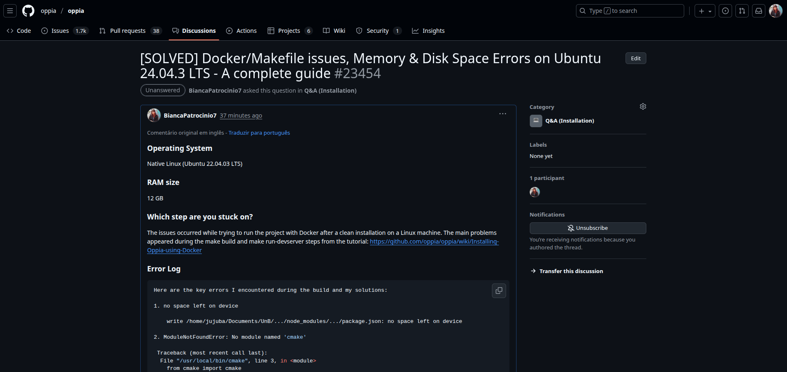
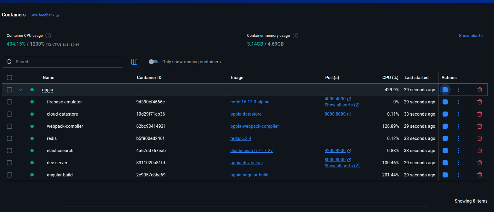
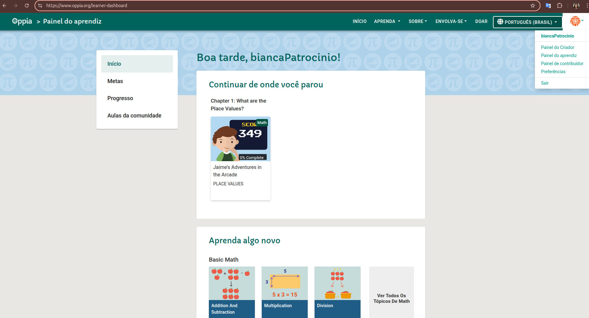
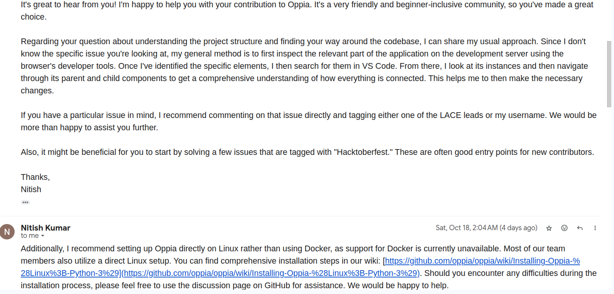
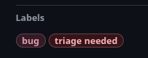
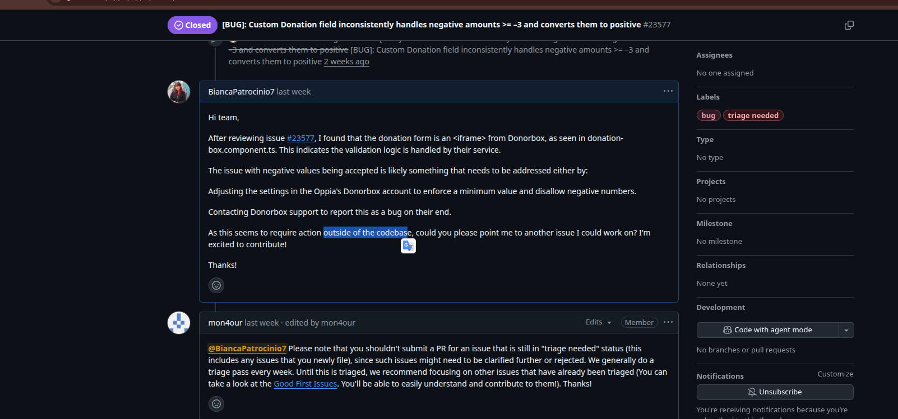
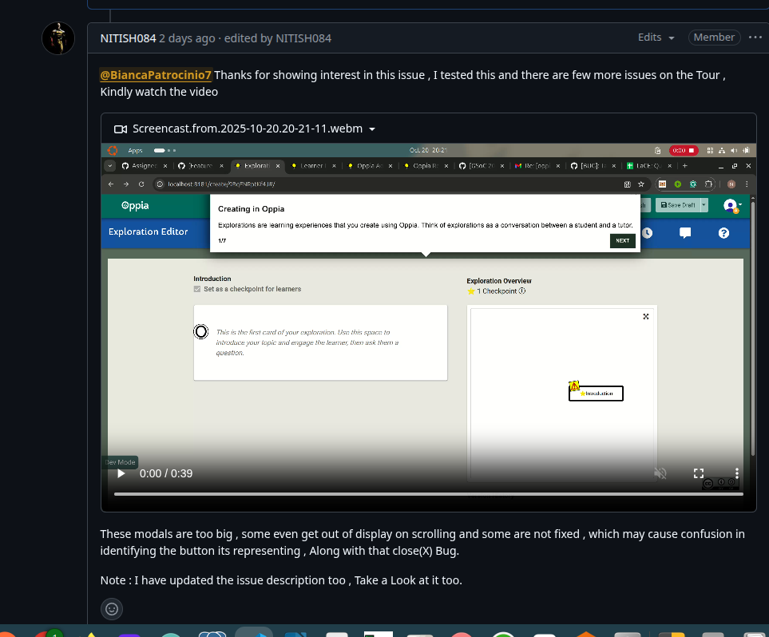

# Diário de Bordo – \[Bianca Patrocínio Castro]

**Disciplina:** \[Gestão da Configuração e Evolução de Software]
**Equipe:** \[Oppia]
**Comunidade/Projeto de Software Livre:** \[Oppia]

---

## Sprint 0 - \[25/08 – 10/09]

### Resumo da Sprint

Neste sprint fiquei focada em conseguir rodar o projeto, onde na Sprint 0 não foi possivel em minha máquina. Além disso procurei entender melhor como funcionar o fluxo de trabalho e links importante para usar como orientação.

### Atividades Realizadas

| Data  | Atividade | Tipo (Código/Doc/Discussão/Outro) | Link/Referência | Status |
| ----- | --------- | --------------------------------- | --------------- | ------ |
| 05/09 | Assinatura do CLA individual | Formulário |  [Link](https://goo.gl/forms/AttNH80OV0) | Concluído |
| 07/09 | Preenchimento do formulário de contribuição | Formulário |  [Link](https://goo.gl/forms/otv30JV3Ihv0dT3C3) | Concluído |
| 10/09 | Apresentação no GitHub discussions | Comentário |  [Link](https://github.com/oppia/oppia/discussions/16715#discussioncomment-14363592) | Concluído |
| 06/09 | Exploração da plataforma | Estudo |  [Link](https://www.oppia.org/) | Concluído |
| 06/09 | Criação do fork | Código | [Link](https://github.com/BiancaPatrocinio7/oppia) | Concluído |
| 09/09 | Configuração do ambiente linux | Código | [Link](https://github.com/oppia/oppia/wiki/Installing-Oppia-%28Linux%3B-Python-3%29)   | Com problemas |
| 10/09 | Mapeamento das políticas para PRs | Estudo | [Link](https://github.com/oppia/oppia/wiki/Rules-for-making-PRs) | Concluído |
| 10/09 | Criação do relatório de contribuição individual | Doc | - | Concluído |

### Maiores Avanços

* Preenchi os formulários necessários e me apresentei no GitHub Discussions. 

* Consegui configurar minha máquina.

* Estudei as políticas de Pull Requests (PRs) e estou estudano para poder pegar a primeira contribuição.

### Maiores Dificuldades

* Não consegui rodar localmente, está dando problema de arquivo não encontrado, estou vendo a possibilidade de refazer mais uma vez a instalação.

* Não consegui instalar via docker.

* Entender o filtro das Issues, há muitas antigas e não sei se já foram resolvidas.

### Aprendizados

* Experiência com ambiente virtual de um projeto grande.

* Achei legal os formulários e a integração com o email.

* Super bacana a documentação, muito importante ter ela disponível.

* Aprendi um pouco mais como funciona um projeto open source com contribuições globais.

### Plano Pessoal para a Próxima Sprint

* [ ] Resolver o problema e rodar localmente.
* [ ] Buscar good-first issues para serem realizadas.
* [ ] Me aprofundar nos padrões do projeto.

## Sprint 1 – \[11/08 – 24/09]

### Resumo da Sprint

Essa sprint foi focada na familiarização com o projeto, a entrada na comunidade, o aprendizado do fluxo de contribuições e a configuração do ambiente.

### Atividades Realizadas

| Data  | Atividade | Tipo (Código/Doc/Discussão/Outro) | Link/Referência | Status |
| ----- | --------- | --------------------------------- | --------------- | ------ |
| 21/09 | Rodei o projeto via Docker | Código |  [Link](https://github.com/oppia/oppia/wiki/Installing-Oppia-using-Docker) | Concluído |
| 15/09 | Mapeamento de site de Documentação e fluxo de trabalho | Estudo | [Link](https://github.com/oppia/oppia/wiki/Rules-for-making-PRs) | Concluído |
| 24/09 | Criação de discursão sobre problema ao tentar rodar via Docker| Discussão | [Link](https://github.com/oppia/oppia/discussions/23454) | Concluído |
| 20/09 | Avaliando a primeira Issue para trabalhar| Estudo | - | Em andamento |

### Maiores Avanços

* Achei o link onde fica mais fácil de buscar issues e ver qual Issue está priorizada: [Link](https://github.com/orgs/oppia/projects/3/views/10)

* Consegui configurar instalação na minha máquina.

* Estudei as políticas de Pull Requests (PRs) e estou estudando para poder pegar a primeira contribuição.

* Após ter conseguido rodar na minha máquina fiz um relato na Wiki de Q&A (Installation), para caso alguém possua um problema parecido irá ter documentado a resolução: [Link](https://github.com/oppia/oppia/discussions/23454) 

Containers do Docker rodando:

### Maiores Dificuldades

* Passei muito tempo tentando rodar o projeto, isso me atrasoi bastante em relação ao que eu tinha idealizado para a Sprint 1. Tentei rodar no Windows, no Mac, via Linux e fui conseguir rodar por Linux via Docker.

* Como o projeto é bastante grande, tive uma certa dificuldade de achar alguns links, tem que procurar em mais de um repositório para identificar 

### Aprendizados

* Aprendi mais sobre como funciona a configuração do Docker e como impacta na hora de rodar.

* Fiz uma boa análise no repositório e até irei utilizar ele na matéria de Qualidade de Software.

### Plano Pessoal para a Próxima Sprint
* [ ] Buscar good-first issues para serem realizadas.
* [ ] Me aprofundar nos padrões do projeto.
* [ ] Abrir a minha primeira Issue.

## Sprint 2 – \[25/09 – 08/10]

### Resumo da Sprint

Essa sprint foi focada em entender sobre o código, ler documentação e navegar pelo site.

### Atividades Realizadas

| Data  | Atividade | Tipo (Código/Doc/Discussão/Outro) | Link/Referência | Status |
| ----- | --------- | --------------------------------- | --------------- | ------ |
| 29/09 | Naveguei pelo site | Estudo |  [Link](https://www.oppia.org/) | Concluído |
| 04/09 | Tradução do aquivo de como abrir um bom PR | Documentação| [Link](https://luizamaluf.github.io/GCES-OPPIA-relatorios/materiais/regras-para-pr/) | Concluído |
| 04/09 | Tradução do aquivo de regras de como abrir uma PR | Documentação| [Link](https://luizamaluf.github.io/GCES-OPPIA-relatorios/materiais/regras-para-pr/)| Concluído|
| 06/09 | Ajustes no GitPags  | Documentação | [Link](https://luizamaluf.github.io/GCES-OPPIA-relatorios/) | Concluído |
| 01/10 | Me aprofudando no codebase do Oppia | Estudo | [Link](https://github.com/oppia/oppia/wiki/Overview-of-the-Oppia-codebase) | Em andamento |

### Maiores Avanços

* Realizei a tradução com o auxílio do Gemini da wiki sobre PRs.

* Estou estudando como funicona a arquitetura do projeto Oppia para poder pegar a minha primeira Issue

* Naveguei pelo site, criei uma conta, achei uns problemas e estou analisando se ja foi criado issues.

Conta criada:

### Maiores Dificuldades

* Entender como funciona o código, cheguei a analisar as Issues para pegar alguma mas como não tenho familiaridade com as linguagens, ainda mais no front onde vi que grande parte das Issues são sobre, acabei decidindo dar um passo para atrás e estudar.

### Aprendizados

* Após navegar entendi melhor como o software oppia funciona e vi que há bastante melhoria a ser feita.
* Entendi mais em regras e padrões do projeto

### Plano Pessoal para a Próxima Sprint
* [ ] Ter uma noção melhor do codebase do Oppia 
* [ ] Procurar uma Issue para trabalhar
* [ ] Documentar como funcionar para pegar uma Issue

## Sprint 3 – \[09/10 – 21/10]

### Resumo da Sprint

Essa sprint foi focada em entender sobre o código, o processo em como pegar uma Issue e testar soluções.

### Atividades Realizadas

| Data  | Atividade | Tipo (Código/Doc/Discussão/Outro) | Link/Referência | Status |
| ----- | --------- | --------------------------------- | --------------- | ------ |
| 12/10 | Busquei uma Issue para resolver | Estudo |  [Link](https://github.com/oppia/oppia/issues) | Concluído |
| 15/10 | Comentário na Issue sobre uma inconscintência na tela de doação | Discussão | [Link](https://github.com/oppia/oppia/issues/23577#issuecomment-3409130188) | Concluído |
| 17/10 | Conversa por e-mail com um Maintaner | Discussão | - | Concluído|
| 20/10 | Dúvida em uma possível Issue minha | Discussão  | [Link](https://github.com/oppia/oppia/issues/23452) | Concluído |
| 21/10 | Testando local e desenvolvendo solução | Código | [Link](https://github.com/oppia/oppia/issues/23452) | Em andamento |

### Maiores Avanços

* Consegui ter contato com um dos Maintener que é bastante ativo no projeto.

* Tive discussões em Issues.

* Entendi melhor como encontrar componentes do site, no código.

### Maiores Dificuldades

* Encontrar uma Issue que eu iria conseguir resolver, apesar de ter muitas as mais recente já tem pessoa assinada, ou estão em triagem.

### Aprendizados

* Antes eu achava que só de ter uma tag de bug já poderia tentar resolver, mas não, no oppia eles tem uma tag de triage needed que significa que aquela Issue ainda não está disponível para desenvolvimento, que precisa de pessoas para verificar se é realmente um bug ou uma feature.

* Fiquei contente pois em um bug que eu analisei, vi que eles faziam uma integração com um componente externo. Fiz um comentário, me responderam que ainda estava em triagem, mas depois de uns dias eles fecharam a Issue pois o componente era realmente externo.

* Estou confiante na Issue #23452, eles foram bem rápidos em responder e através da  minha mensagem perceberam que o erro era diferente do inicial.

### Plano Pessoal para a Próxima Sprint
* [ ] Ter o assign da Issue #23452
* [ ] Abrir PR da  Issue #23452
* [ ] Procurar uma próxima Issue para contribuir

## Sprint 4 – [22/10 – 05/11]

### Resumo da Sprint

Esta sprint foi marcada por problemas técnicos com meu equipamento e a necessidade de reconfiguração do ambiente, além de retomar a análise da Issue iniciada na sprint anterior.

### Atividades Realizadas

| Data  | Atividade | Tipo (Código/Doc/Discussão/Outro) | Link/Referência | Status |
| ----- | --------- | --------------------------------- | --------------- | ------ |
| 25/10 | Reconfiguração do ambiente após formatação | Configuração | [Link](https://github.com/oppia/oppia/wiki/Installing-Oppia-using-Docker) | Concluído |
| 28/10 | Estudo aprofundado da Issue \#23452 | Estudo | [Link](https://github.com/oppia/oppia/issues/23452) | Em andamento |
| 03/11 | Tentativa de reprodução do erro localmente | Código | - | Em andamento |

### Maiores Avanços

  * Consegui rodar local o Oppia na minha máquina sem ser via Docker, após formatar o computador.
  * Retomei o foco na Issue \#23452 para pesquisar uma possível solução.

### Maiores Dificuldades

  * Tive que formatar meu computador, o que consumiu boa parte do tempo da sprint reinstalando dependências, Docker e configurando o ambiente Linux novamente.
  * O processo de *setup* do Oppia é demorado e propenso a falhas de versão.

### Aprendizados

  * Reforcei o aprendizado sobre a instalação via Docker.
  * Aprendi a importância de ter um backup ou scripts de configuração para agilizar o setup do ambiente de desenvolvimento.

### Plano Pessoal para a Próxima Sprint

  * [ ] Transformar a discussão da instalação em uma contribuição real.
  * [ ] Tentar solucionar a Issue \#23452.

-----

## Sprint 5 – [06/11 – 17/11]

### Resumo da Sprint

Foco total em converter as discussões e aprendizados em contribuições concretas (Issues e PRs).

### Atividades Realizadas

| Data  | Atividade | Tipo (Código/Doc/Discussão/Outro) | Link/Referência | Status |
| ----- | --------- | --------------------------------- | --------------- | ------ |
| 08/11 | Adicionei um tópico na Discussão de Q\&A (Installation) | Discussão |  [Link](https://github.com/oppia/oppia/discussions/23814) | Concluído |
| 09/11 | Issue criada a partir da minha Discussão | Issue | [Link](https://github.com/oppia/oppia/issues/23815) | Concluído |
| 09/11 | Pull Request Criado | Código | [Link](https://github.com/oppia/oppia/pull/23825) | Concluído|
| 11/11 | Discussão na Pull Request | Discussão  | [Link](https://github.com/oppia/oppia/pull/23825)  |  Em andamento  |
| 15/11 | Testando local e desenvolvendo solução | Código | [Link](https://github.com/oppia/oppia/issues/23452) | Em andamento |

### Maiores Avanços

  * **Primeira Issue atribuída:** Consegui transformar uma discussão sobre instalação em uma Issue formal (\#23815).
  * **Primeiro PR Aberto:** Abri o PR \#23825 resolvendo a issue de documentação/instalação.

### Maiores Dificuldades

  * **Comunicação assíncrona:** Estou aguardando retorno do maintainer sobre o PR. Ele solicitou um ajuste em teste unitário, mas a documentação/link de referência que ele passou não contém o exemplo necessário, dificultando o avanço.

### Aprendizados

  * **Fluxo Discussão -\> Issue:** Aprendi que é possível criar uma Issue diretamente a partir de uma discussão no GitHub.
  * **Pre-push hooks:** Entendi como o Oppia utiliza scripts de pré-push para verificar erros e monitorar arquivos antes do commit.

### Plano Pessoal para a Próxima Sprint

  * [ ] Finalizar o merge do PR \#23825.
  * [ ] Consolidar as contribuições finais.

-----

## Sprint 6 – [18/11 – Atual]

### Resumo da Sprint

Esta sprint final foi dedicada à consolidação das contribuições realizadas ao longo do semestre e à reflexão sobre os desafios enfrentados no projeto Oppia.

### Contribuições Individuais

Abaixo estão listadas as contribuições efetivas realizadas no repositório:

1.  **Issue \#23815 (Installation Documentation):**

      * *Descrição:* Identifiquei que novos contribuidores (incluindo eu mesma) tinham dificuldades recorrentes com a instalação e que as soluções estavam dispersas em discussões, não na wiki oficial.
      * *Status:* **Resolvida/Convertida em PR**.
      * *Link:* [Issue \#23815](https://github.com/oppia/oppia/issues/23815)

2.  **Pull Request \#23825:**

      * *Descrição:* Atualização da documentação de instalação para incluir soluções para problemas comuns enfrentados por usuários Linux/Docker, facilitando o *onboarding* de novos desenvolvedores.
      * *Status:* Em revisão (Aguardando feedback final do maintainer sobre testes).
      * *Link:* [PR \#23825](https://github.com/oppia/oppia/pull/23825)

3.  **Discussão \#23814 #23454(Q\&A):**

      * *Descrição:* Documentação ativa de erros e soluções na aba de discussões da comunidade.
      * *Link:* [Discussion \#23814](https://github.com/oppia/oppia/discussions/23814)
      * *Link:* [Discussion \#23454](https://github.com/oppia/oppia/discussions/23454)

### Dificuldades Gerais no Projeto

Durante todo o período de contribuição para o Oppia, as maiores barreiras encontradas foram:

 * **Disponibilidade e Concorrência por Issues:** Era extremamente difícil conseguir pegar ("claim") uma Issue. Como o projeto é global e ativo, o tempo necessário para eu estudar o problema e o código era maior do que a rotatividade das tarefas. Frequentemente, quando eu terminava de entender e estava pronta para desenvolver, a Issue já havia sido resolvida por outra pessoa ou já tinha um assignee definido. Isso gerou uma barreira para mim em conseguir contribuir nas Issues.

  * **Complexidade do Ambiente (Setup):** A barreira de entrada é extremamente alta. A configuração envolve Docker, Python, configurações específicas de Linux e scripts proprietários do Oppia. Grande parte do tempo (Sprints 0, 1 e 4) foi consumida apenas tentando fazer o software rodar localmente ("It works on my machine" é um problema real aqui).
  * **Curva de Aprendizado do Codebase:** O projeto é massivo. Localizar onde um componente visual está definido no código exige navegação por múltiplos diretórios e entendimento de uma arquitetura legada misturada com novas implementações (Angular/Python).
  * **Processo de Triagem e Comunicação:** O fluxo de contribuição é rígido. Issues precisam passar por triagem ("Triage Needed") antes de serem disponibilizadas. Além disso, a comunicação com maintainers, apesar de educada, pode ser lenta devido a fusos horários e alta demanda de revisões, como ocorreu no bloqueio do meu PR por falta de referência clara sobre testes unitários.
  * **Documentação vs. Realidade:** Embora a documentação seja extensa, em alguns pontos ela está desatualizada em relação ao estado atual do código ou assume conhecimentos prévios que novos contribuidores não possuem.

### Conclusão

Apesar das dificuldades técnicas, a experiência proporcionou um entendimento profundo sobre o ciclo de vida de um projeto Open Source de grande escala, desde a etiqueta de comunicação em Issues até a complexidade de manter um ambiente de CI/CD e testes rigorosos.