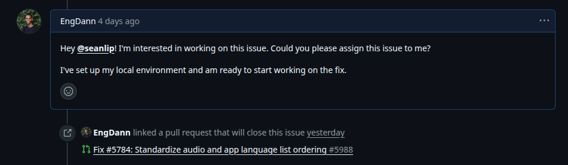
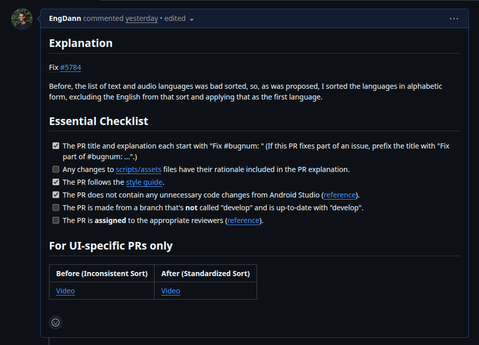
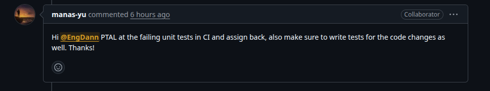
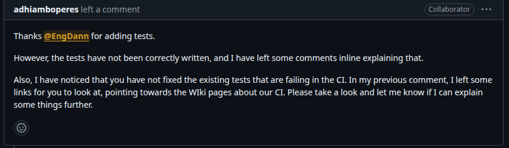
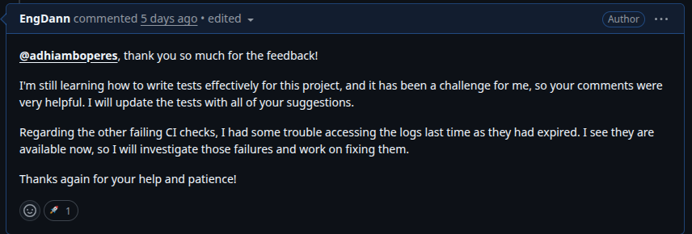
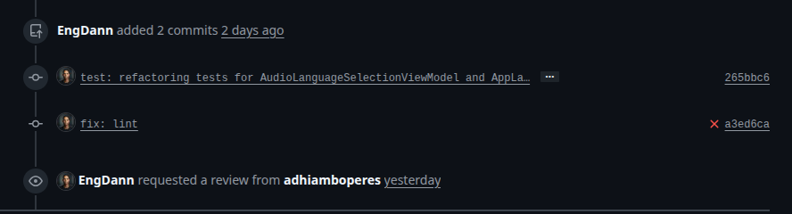

# Diário de Bordo – Danilo de Melo Ribeiro

**Disciplina:** Gestão da Configuração e Evolução de Software\
**Equipe:** Oppia\
**Comunidade:** Oppia

---

## Sprint 0 – \[25/08 – 10/09]

### Resumo da Sprint

Esta sprint inicial teve como foco a integração ao projeto Oppia e a estruturação da equipe. Os objetivos principais foram realizar o _onboarding_ no ecossistema do projeto, compreender suas diretrizes de contribuição e configurar o ambiente de desenvolvimento para futuras contribuições.

### Atividades Realizadas

| Data  | Atividade                                                               | Tipo (Código/Doc/Discussão/Outro) | Link/Referência                                                                                                                                      | Status    |
| :---- | :---------------------------------------------------------------------- | :-------------------------------- | :--------------------------------------------------------------------------------------------------------------------------------------------------- | :-------- |
| 25/08 | Criação do fork do repositório oficial                                  | Código                            | [Github](https://github.com/EngDann/oppia)                                                                                                           | Concluído |
| 25/08 | Análise da documentação e arquitetura do projeto                        | Estudo                            | [Overview-of-the-Oppia-codebase](https://github.com/oppia/oppia/wiki/Overview-of-the-Oppia-codebase)                                                 | Concluído |
| 04/09 | Mapeamento das diretrizes de contribuição e qualidade                   | Estudo                            | [Oppia Wiki](https://github.com/oppia/oppia/wiki)                                                                                                    | Concluído |
| 06/09 | Alinhamento da estratégia de trabalho da equipe                         | Discussão                         | Reunião interna da equipe                                                                                                                            | Concluído |
| 06/09 | Configuração do ambiente de desenvolvimento (Linux)                     | Código                            | [Installing Oppia (Linux; Docker)](https://github.com/oppia/oppia/wiki/Installing-Oppia-using-Docker)                                                | Concluído |
| 09/09 | Criação do relatório de contribuição individual                         | Doc                               | -                                                                                                                                                    | Concluído |
| 10/09 | Preenchimento dos formulários para iniciar comunicação com a comunidade | Formulário                        | [Forms](https://docs.google.com/forms/d/e/1FAIpQLSfoFLKT4BlNH2937mSMJATVaWq-yBSrq8p3jjrPwcMw3gaGcg/alreadyresponded?c=0&w=1&fbzx=947187622883277373) | Concluído |

### Maiores Avanços

-   A equipe foi organizada e o fork do repositório, que servirá como base para as contribuições acadêmicas, foi criado com sucesso.
-   Foi obtida uma compreensão clara das políticas de contribuição, padrões de qualidade e fluxos de comunicação da comunidade Oppia.
-   O ambiente de desenvolvimento foi configurado e executado localmente com sucesso via Docker.

### Maiores Dificuldades

-   O processo de build inicial do projeto foi extenso, exigindo um alto consumo de recursos computacionais.

### Aprendizados

-   Compreensão aprofundada da estrutura do projeto Oppia, seu fluxo de trabalho e a organização da comunidade, incluindo os diferentes papéis e responsabilidades.
-   Aprofundamento prático em Docker, ferramenta escolhida para a configuração do ambiente.

### Plano Pessoal para a Próxima Sprint

-   [ ] Mapear e selecionar _issues_ relacionadas a CI/CD e DevOps para alinhar as contribuições com os meus objetivos pessoais e aproveitar ao máximo a disciplina.
-   [ ] Iniciar a colaboração ativa com a equipe e os mantenedores do Oppia para solucionar a _issues_ escolhidas.
-   [ ] Aplicar e consolidar os conhecimentos de CI/CD e DevOps através da contribuição prática no projeto.

---

## Sprint 1 – [10/09 – 24/09]

### Resumo da Sprint

Nesta sprint, eu reavaliei meu foco inicial no projeto. Descobri que o Oppia mantém um repositório dedicado ao Android, uma área que despertou muito mais meu interesse. Com isso, decidi concentrar meus esforços em compreender a fundo este novo repositório, sua estrutura e seus objetivos. Para me integrar mais rapidamente, entrei em contato com um contribuidor experiente do projeto e participante do GSoC, que me ajudou a esclarecer diversas dúvidas técnicas e sobre a comunidade.

### Atividades Realizadas

| Data  | Atividade                                                                  | Tipo (Código/Doc/Discussão/Outro) | Link/Referência                                                                            | Status    |
| :---- | :------------------------------------------------------------------------- | :-------------------------------- | :----------------------------------------------------------------------------------------- | :-------- |
| 15/09 | Identificação e análise inicial do repositório Oppia-Android               | Estudo                            | [GitHub: oppia-android](https://github.com/oppia/oppia-android)                            | Concluído |
| 16/09 | Estudo da arquitetura e das diretrizes de contribuição do Android          | Estudo                            | [Wiki: Developing for Oppia-Android](https://github.com/oppia/oppia-android/wiki)          | Concluído |
| 18/09 | Primeiro contato com um dos contribuidores da comunidade                   | Discussão                         | Comuinicação direta                                                                        | Concluído |
| 19/09 | Tive uma conversa com o mantenedor para esclarecer dúvidas sobre o projeto | Discussão                         | Comunicação direta (Discord/GitHub)                                                        | Concluído |
| 22/09 | Configurei o ambiente de desenvolvimento específico para o Android         | Código                            | [Guia de Instalação](https://github.com/oppia/oppia-android/wiki/Installing-Oppia-Android) | Concluído |

### Maiores Avanços

-   A descoberta de uma área no projeto (Android) que me motiva genuinamente a contribuir.
-   A conversa com o mantenedor foi fundamental. Ele compartilhou conhecimentos que aceleraram minha compreensão do projeto e da dinâmica da comunidade.
-   Agora tenho um entendimento claro da estrutura do projeto Android e de por onde posso começar a aplicar minhas habilidades.

### Maiores Dificuldades

-   A principal dificuldade foi a percepção de que meu foco inicial não era o ideal, o que consumiu parte do tempo da sprint e gerou a necessidade de correr atrás do prejuízo.
-   A configuração do ambiente de desenvolvimento foi desafiadora. O Android Studio exige muitos recursos computacionais, o processo de setup é longo e, após várias tentativas, a única versão que se mostrou compatível foi a "Giraffe".

### Aprendizados

-   Aprendi como é importante encontrar uma área de contribuição que esteja alinhada com meus interesses, pois a diferença na motivação é enorme.
-   Percebi que a comunicação proativa com membros experientes é uma ferramenta muito eficaz para acelerar o aprendizado.
-   Obtive um conhecimento prático valioso sobre a arquitetura de um aplicativo Android de código aberto e em larga escala.

### Plano Pessoal para a Próxima Sprint

-   [ ] Identificar e selecionar duas `good first issues` ou tarefas de escopo similar para começar a contribuir com código.
-   [ ] Focar na implementação para compensar o período de estudo e adaptação desta sprint.
-   [ ] O objetivo principal é submeter, 2 _Pull Requests_ (PRs) de qualidade.

---

### Sprint 2 – \[24/09 – 08/10]

### Resumo da Sprint

Esta sprint foi dedicada à **imersão** na arquitetura Android do projeto Oppia e à conclusão da primeira contribuição de código. O foco principal foi entender os padrões de código (MVP/MVVM/MVC), o uso de **Dagger** para injeção de dependência, e as diretrizes de testes do projeto. Embora o objetivo inicial de submeter múltiplos PRs não tenha sido totalmente atingido devido à complexidade do código, um PR inicial foi aberto com sucesso para resolver um bug de ordenação de idiomas, validando a correção da lógica implementada.

### Atividades Realizadas

| Data  | Atividade                                                                | Tipo (Código/Doc/Discussão/Outro) | Link/Referência                                                                                         | Status     |
| :---- | :----------------------------------------------------------------------- | :-------------------------------- | :------------------------------------------------------------------------------------------------------ | :--------- |
| 25/09 | Estudo da arquitetura, padrões do código, injeção de dependência         | Estudo                            | Documentação do Oppia e código-fonte                                                                    | Concluído  |
| 04/10 | Identificação e análise do `good first issue` sobre ordenação de idiomas | Discussão/Estudo                  | Issue [\#5784](https://www.google.com/search?q=https://github.com/oppia/oppia-android/issues/5784)      | Concluído  |
| 06/10 | Implementação da lógica de ordenação para idiomas de app e áudio         | Código                            | Snippets de código e arquivos `ViewModel` modificados                                                   | Concluído  |
| 07/10 | Criação e abertura do _Pull Request_ para correção da ordenação          | Código                            | [PR **\#5988**](https://github.com/oppia/oppia-android/pull/5988)                                       | Aberto     |
| 08/10 | Recebimento de _feedback_ do mantenedor sobre testes em CI               | Discussão                         | [Comentário do revisor na PR](https://github.com/oppia/oppia-android/pull/5988#issuecomment-3381112399) | Em Análise |

### Maiores Avanços

-   O primeiro **Pull Request (\#5988)** foi aberto, marcando a primeira contribuição de código ao projeto.
-   Houve uma grande evolução na compreensão dos **padrões de codificação** do Oppia, algo essencial para mexer em um projeto tão complexo.

Designado para a task #5784:

PR aberto:

Comentário do mantenedor:

### Maiores Dificuldades

-   A complexidade e o tamanho do código-fonte do Oppia-Android exigiram muito tempo de estudo, o que impactou o plano inicial para esta sprint.
-   O principal obstáculo atual é a **escrita de testes** para validar a alteração e o **continuo aprendizado sobre o projeto**. O PR recebeu _feedback_ solicitando a correção de testes em CI e a adição de novos testes para a funcionalidade modificada.

### Aprendizados

-   Aprendi na prática que em grandes projetos de código aberto, a **qualidade do teste** é tão crucial quanto a qualidade do código em si, e muitas vezes é o principal bloqueador para o _merge_.

### Plano Pessoal para a Próxima Sprint

-   [ ] Resolver o _feedback_ do PR \#5988, focando na escrita dos **testes** para a lógica de ordenação de idiomas.
-   [ ] Identificar uma nova tarefa `good first issue` e garantir um segundo PR mergeado.

### Sprint 3 – \[08/10 – 22/10]

### Resumo da Sprint

Esta sprint foi dedicada a **resolver o feedback técnico do Pull Request #5988**. O foco foi a correção e implementação de testes. O processo foi iterativo: uma primeira tentativa de implementação gerou um feedback detalhado do mantenedor (com mais de 12 alterações solicitadas), o que levou a uma análise mais profunda dos testes já existentes. Ao final, todas as correções foram implementadas e submetidas para revisão novamente.

### Atividades Realizadas

| Data  | Atividade                                                                                               | Tipo (Código/Doc/Discussão) | Link/Referência                                                             | Status    |
| :---- | :------------------------------------------------------------------------------------------------------ | :-------------------------- | :-------------------------------------------------------------------------- | :-------- |
| 09/10 | Análise inicial da arquitetura de testes                                                                | Estudo/Código               | Módulos de teste do Oppia                                                   | Concluído |
| 16/10 | Primeira tentativa de implementação dos testes solicitados                                              | Código                      | Commits locais                                                              | Concluído |
| 17/10 | Discussão com o mantenedor sobre a abordagem e recebimento de feedback detalhado (+12 pontos de ajuste) | Discussão                   | [Comentários no PR #5988](https://github.com/oppia/oppia-android/pull/5988) | Concluído |
| 20/10 | Implementação final de todas as correções e novos testes solicitados                                    | Código                      | [Commits no PR #5988](https://github.com/oppia/oppia-android/pull/5988)     | Concluído |

### Maiores Avanços

-   Todo o feedback técnico do PR #5988 foi implementado. O PR agora contém as correções e testes solicitados, passando nas validações locais.
-   Aprofundei meu conhecimento prático na suíte de testes do Oppia.
-   O Pull Request está agora pronto para a revisão final do mantenedor.

Comentário do mantenedor sobre testes adicionados:

 - 17/10

Resposta ao mantenedor:

 - 17/10

Commits com as correções solicitadas:

 - 20/10

### Maiores Dificuldades

-   A principal dificuldade foi a complexidade da suíte de testes. A necessidade de analisar arquivos grandes e com contextos muito interligados tornou o processo de depuração e implementação mais lento que o esperado.

### Aprendizados

-   Em projetos grandes, é crucial entender como uma mudança afeta os testes já existentes para não introduzir regressões.
-   Analisar e corrigir falhas apontadas pela CI é uma habilidade prática e indispensável para colaborar efetivamente.

### Plano Pessoal para a Próxima Sprint

-   [ ] Acompanhar ativamente o PR #5988, respondendo a qualquer novo feedback para garantir o **merge**.
-   [ ] Identificar e ser designado para uma nova `good first issue`.
-   [ ] Iniciar o desenvolvimento da nova issue com o objetivo de mergear um segundo PR até o final da sprint.
