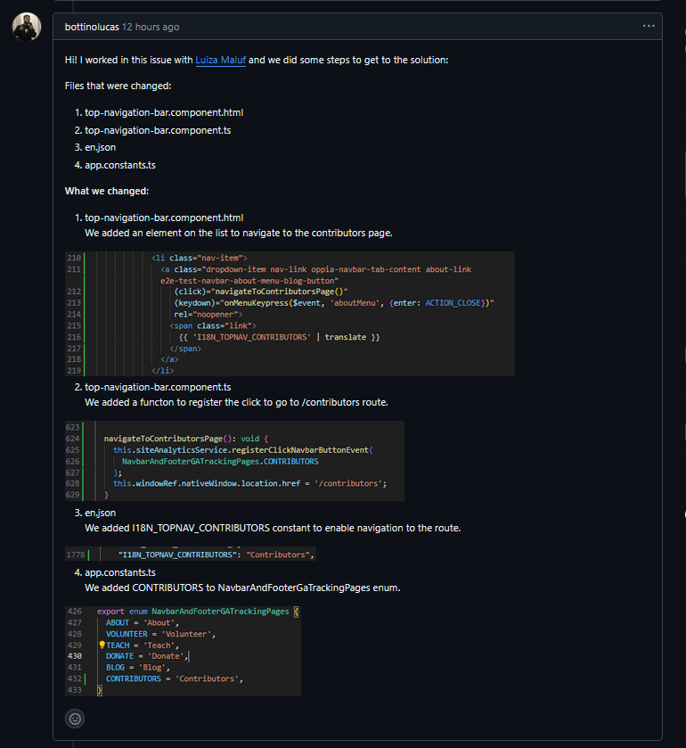

# Diário de Bordo – \[Luiza Maluf Amorim]

**Disciplina:** \[Gestão da Configuração e Evolução de Software]
**Equipe:** \[Oppia]
**Comunidade/Projeto de Software Livre:** \[Oppia]

---

## Sprint 0 – \[25/08 – 10/09]

### Resumo da Sprint

Essa sprint foi focada em organizar a equipe, criar o fork e o repositório de documentação, além de estudar as políticas de contribuição e práticas de GCES do Oppia. Também realizamos a configuração do ambiente local, documentando os problemas e aprendizados.

### Atividades Realizadas

| Data  | Atividade | Tipo (Código/Doc/Discussão/Outro) | Link/Referência | Status |
| ----- | --------- | --------------------------------- | --------------- | ------ |
| 25/08 | Criação do fork | Código | [Link](https://github.com/LuizaMaluf/oppia) | Concluído |
| 25/08 | Leitura e estudo da documentação do projeto | Estudo                            | [Link](https://github.com/oppia/oppia/wiki/Overview-of-the-Oppia-codebase) | Concluído |
| 01/09 | Mapeamento das políticas de contribuição do Oppia | Estudo | [Link](https://github.com/oppia/oppia/wiki) | Concluído |
| 08/09 | Configuração do ambiente linux | Código | [Link](https://github.com/oppia/oppia/wiki/Installing-Oppia-%28Linux%3B-Python-3%29)   | Concluído |
| 08/09 | Definição de linha de trabalaho | Discussção | - | Concluido | 
| 09/09 | Criação do repositório de documentação dos relatórios | Doc |  [Link](https://github.com/LuizaMaluf/GCES-OPPIA-relatorios) | Concluído |
| 09/09 | Preenchimento do formulário de contribuição | Formulário |  [Link]([https://github.com/LuizaMaluf/GCES-OPPIA-relatorios](https://docs.google.com/forms/d/e/1FAIpQLSfoFLKT4BlNH2937mSMJATVaWq-yBSrq8p3jjrPwcMw3gaGcg/viewform?c=0&w=1)) | Concluído |

### Maiores Avanços

* Preenchi o formulário requerido concordando com as regras de contribuição para o projeto.

* Consegui rodar o projeto Oppia localmente após configuração.

* Compreensão das políticas de contribuição, qualidade e comunicação da comunidade Oppia.

* Organização inicial da equipe e do repositório acadêmico.

### Maiores Dificuldades

* Foi minha primeira vez usando WSL e configurei de forma incorreta.

* Precisei reinstalar o WSL para prosseguir com a configuração do ambiente.

* O tempo de build inicial também foi longo, o que atrasou a validação do setup.

### Aprendizados

* Ganhei experiência na instalação e uso do WSL para desenvolvimento.

* Entendi melhor a importância de seguir passo a passo a documentação oficial para evitar erros de configuração.

* Aprendi a lidar com reinstalação e reconfiguração do ambiente como parte do processo de GCES.

### Plano Pessoal para a Próxima Sprint

* [ ] Buscar issues relacionadas a CI e erros na parte de DevOps do Oppia.
* [ ] Trabalhar em conjunto com Lucas Bottino para resolver problemas identificados.
* [ ] Consolidar aprendizados sobre pipelines e integração contínua.

---

## Sprint 1 – \[10/09 – 24/09]

### Resumo da Sprint

Essa sprint foi dedicada à contribuição efetiva no código da comunidade Oppia. Em conjunto com meu colega Lucas Bottino, trabalhamos na issue [#22915](https://github.com/oppia/oppia/issues/22915), que consistia em adicionar um link para a página de Contributors no menu suspenso About da barra de navegação superior.

O trabalho envolveu identificar os arquivos responsáveis pelo componente de navegação, realizar as alterações necessárias, validar a solução localmente e preparar a submissão do PR.

### Atividades Realizadas

| Data           | Atividade                                  | Tipo (Código/Doc/Discussão/Outro) | Link/Referência | Status        |
| -------------- | ------------------------------------------ | --------------------------------- | --------------- | ------------- |
| 15/09          | Estudo da issue e histórico de PRs relacionados | Estudo | [Issue #22915](https://github.com/oppia/oppia/issues/22915) | Concluído     |
| 23/09          | Identificação dos arquivos relevantes para a alteração | Código | `top-navigation-bar.component.html`, `top-navigation-bar.component.ts` | Concluído     |
| 23/09          | Implementação da adição do link no menu    | Código | - | Concluído     |
| 23/09          | Inclusão de suporte a i18n e constantes    | Código | `en.json`, `app.constants.ts` | Concluído     |
| 04/10          | Testes locais da navegação                 | Código | - | Incompleto    |
| 23/10 - 24/10  | Discussão e interação com o maintainer @mon4our | Discussão | [Issue #22915](https://github.com/oppia/oppia/issues/22915) | Em andamento  |
| 24/10          | Assigne da issue para subir o PR           | Outro | Aguardando maintainer | Pendente      |

### Maiores Avanços

* Conseguimos implementar a feature de forma limpa e alinhada com a issue.  
* Identificamos rapidamente os arquivos certos a modificar graças ao estudo do PR anterior (#22560).  
* Trabalhamos em colaboração para dividir tarefas e revisar mutuamente o código.  

### Maiores Dificuldades

* Foi necessário entender o fluxo de internacionalização (i18n) do Oppia para inserir a nova chave.  
* A navegação exigiu atualização também no **tracking de GA**, o que não estava descrito na issue.  
* Dependência da validação dos maintainers para confirmar se a solução segue o padrão esperado.  

### Aprendizados

* Ganhamos experiência em **trabalhar com componentes Angular** dentro de um projeto grande como o Oppia.  
* Entendemos melhor o processo de contribuição e interação com maintainers (apresentar mudanças, aguardar validação e fornecer evidências).  
* Aprendi a importância de manter a consistência entre o **footer** e o **top navigation bar** em termos de UX.  

### Plano Pessoal para a Próxima Sprint

* [ ] Finalizar a submissão do PR com o vídeo de demonstração solicitado.  
* [ ] Explorar novas issues relacionadas à **CI/CD** e **testes automatizados** no Oppia.   