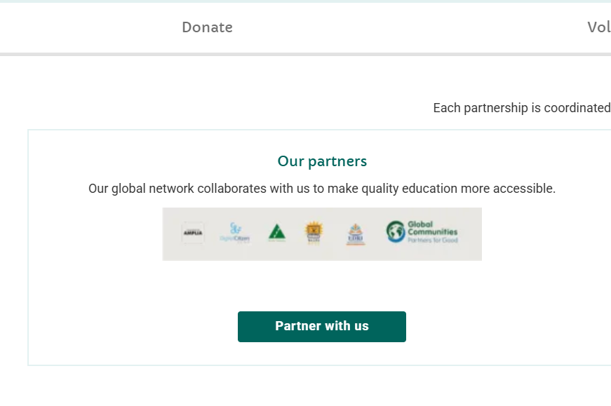
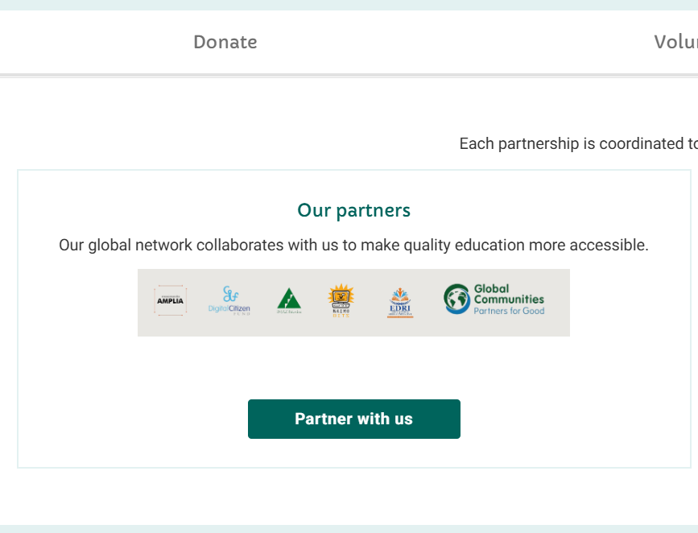

# Diário de Bordo – [Nathan Abreu]

**Disciplina:** [Gestão da Configuração e Evolução de Software]  
**Equipe:** [Oppia]  
**Comunidade/Projeto de Software Livre:** [Oppia]

---

## Sprint 0 – [25/08 – 10/09]

### Resumo da Sprint

Essa sprint foi focada em organizar a equipe, criar o fork e o repositório de documentação, além de estudar as políticas de contribuição e práticas de GCES do Oppia. Também realizei a configuração do ambiente local, documentando os problemas e aprendizados adquiridos durante o processo.

### Atividades Realizadas

| Data  | Atividade | Tipo (Código/Doc/Discussão/Outro) | Link/Referência | Status |
| ----- | ---------- | --------------------------------- | --------------- | ------ |
| 25/08 | Estudo do manual de contribuição | Estudo | [Link](https://github.com/oppia/oppia/wiki) | Concluído |
| 09/09 | Fork do repositório do projeto | Código | [Link](https://github.com/Maliz30/oppia) | Concluído |
| 09/09 | Envio do termo de licença de contribuição (CLA) | Formulário | [Link](https://docs.google.com/forms/d/e/1FAIpQLSfoFLKT4BlNH2937mSMJATVaWq-yBSrq8p3jjrPwcMw3gaGcg/viewform?c=0&w=1) | Concluído |
| 09/09 | Leitura das normas de conduta do projeto | Estudo | [Link](https://github.com/oppia/oppia/blob/develop/.github/CODE_OF_CONDUCT.md) | Concluído |
| 09/09 | Resposta ao formulário de contribuição individual | Formulário | [Link](https://docs.google.com/forms/u/0/d/e/1FAIpQLSfiOd5WQp--PlbKAPmPLF14m0Ix2nTPwth9nb_48AHDv9fauw/formResponse) | Concluído |
| 09/09 | Instalação e configuração do ambiente no Linux | Código | [Link](https://github.com/oppia/oppia/wiki/Installing-Oppia-%28Linux%3B-Python-3%29) | Concluído |
| 09/09 | Registro do diário de bordo individual da Sprint 0 | Doc | - | Concluído |

### Maiores Avanços

* Completei o envio do termo de licença de contribuição e do questionário individual.  
* Fiz a leitura das principais documentações e políticas de conduta do projeto.  
* Consegui configurar o ambiente de desenvolvimento local.  
* Registrei o processo no repositório do grupo.  

### Maiores Dificuldades

* Dificuldade em equilibrar as demandas da disciplina com outras atividades.  
* Volume alto de informações iniciais para compreender em pouco tempo.  

### Aprendizados

* Entendimento sobre a estrutura e organização de um repositório open source.  
* Maior clareza sobre as etapas iniciais de colaboração em projetos de código aberto.  

### Plano Pessoal para a Próxima Sprint

* [ ] Procurar *good first issues* para começar a contribuir.  
* [ ] Resolver a primeira issue e documentar o processo.  
* [ ] Engajar-se mais nas reuniões e atividades da equipe GCES.  

---

## Sprint 1 – [10/09 – 24/09]

### Resumo da Sprint

Essa sprint foi focada em realizar a primeira contribuição efetiva no código da comunidade Oppia. Encontrei a issue **#23387**, que solicitava a substituição de imagens de baixa qualidade por versões aprimoradas. Subi o ambiente, produzi uma nova imagem com as logos dos parceiros e validei a correção localmente. Após isso, iniciei o contato com o mantenedor do projeto para aprovação e posterior abertura do Pull Request.

### Atividades Realizadas

| Data | Atividade | Tipo (Código/Doc/Discussão/Outro) | Link/Referência | Status |
| ----- | ---------- | --------------------------------- | --------------- | ------ |
| 15/09 | Estudo da issue e análise de PRs relacionados | Estudo | [Issue #23387](https://github.com/oppia/oppia/issues/23387#issuecomment-3329681531) | Concluído |
| 21/09 | Identificação dos arquivos de imagem relevantes | Código | `partners15x.png`, `partners15x.webp` | Concluído |
| 22/09 | Criação de imagem aprimorada no Canva com logos dos parceiros | Código | - | Concluído |
| 23/09 – 24/09 | Discussão e interação com o maintainer @mon4our | Discussão | [Issue #23387](https://github.com/oppia/oppia/issues/23387#issuecomment-3329681531) | Em andamento |
| 26/09 | Aguardando *assignee* da issue para submissão do PR | Outro | - | Pendente |

### Maiores Avanços

* Entrei em contato direto com a equipe Oppia.  
* Criei e substituí imagens de forma bem-sucedida, resolvendo a issue localmente.  
* Consegui entender melhor o fluxo de contribuição e a interação com os mantenedores.  
* Registrei todo o processo no repositório do grupo.  

Antes:  
  

Depois:  
  

### Maiores Dificuldades

* Comunicação e alinhamento com a equipe de GCES.  
* Demora no processo de *assignment* da issue por parte do maintainer.  

### Aprendizados

* Navegação e entendimento de um projeto open source de grande escala.  
* Familiarização com o processo de contribuição e validação de PRs.  

### Plano Pessoal para a Próxima Sprint

* [ ] Resolver uma nova issue no projeto.  
* [ ] Colaborar para a criação de alguma questão para o Oppia.  
* [ ] Engajar-se de forma mais participativa nas reuniões da equipe da disciplina de GCES.  
