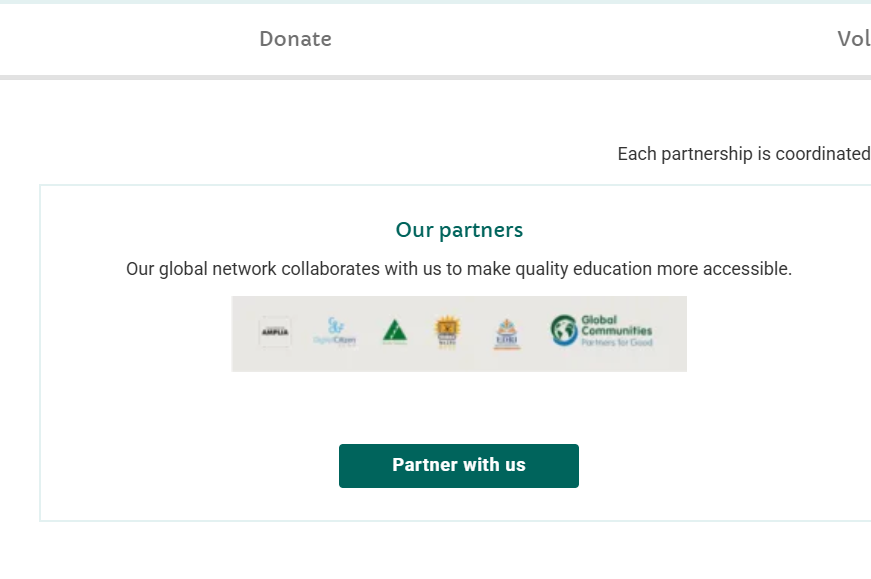
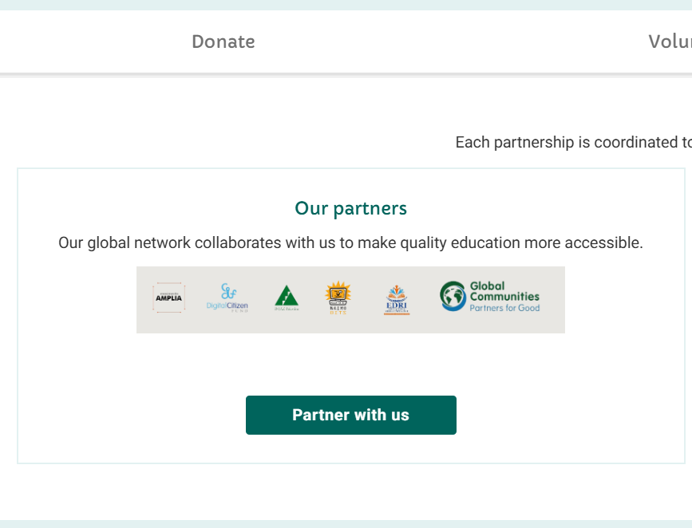
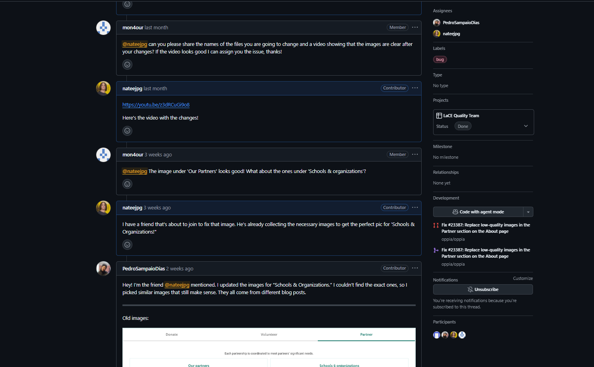
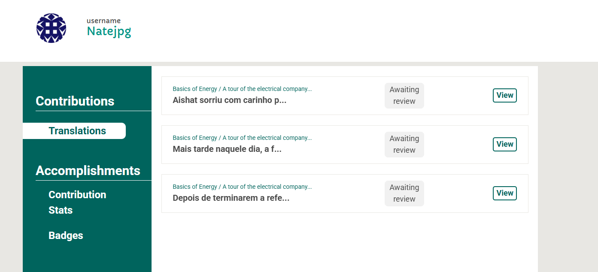
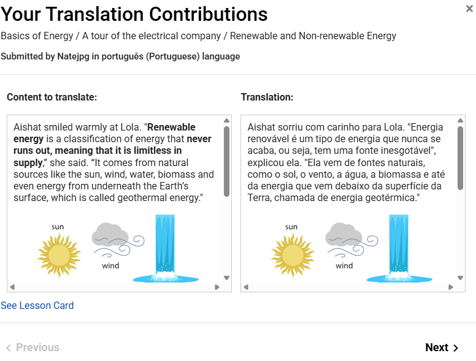
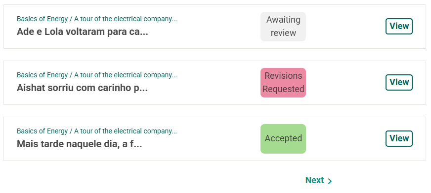
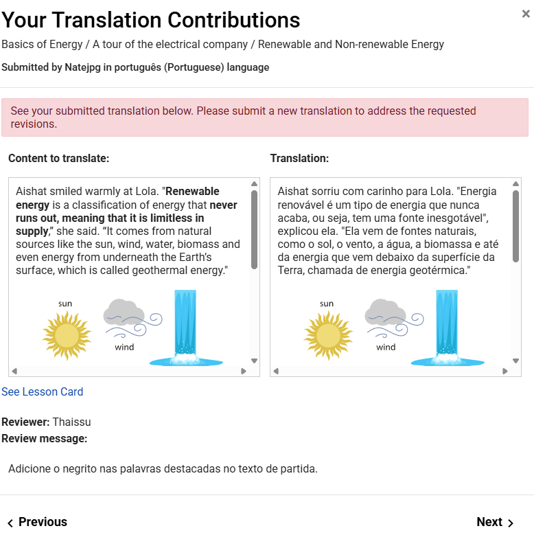
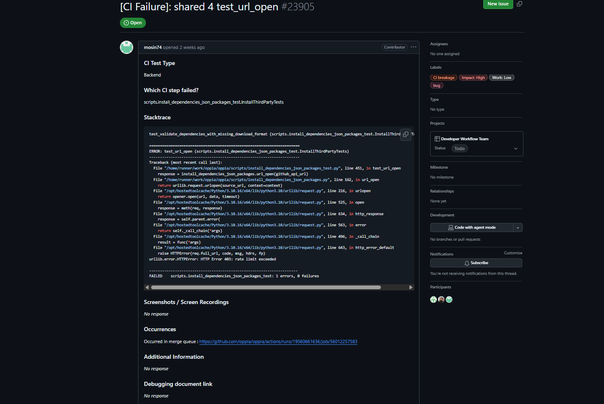
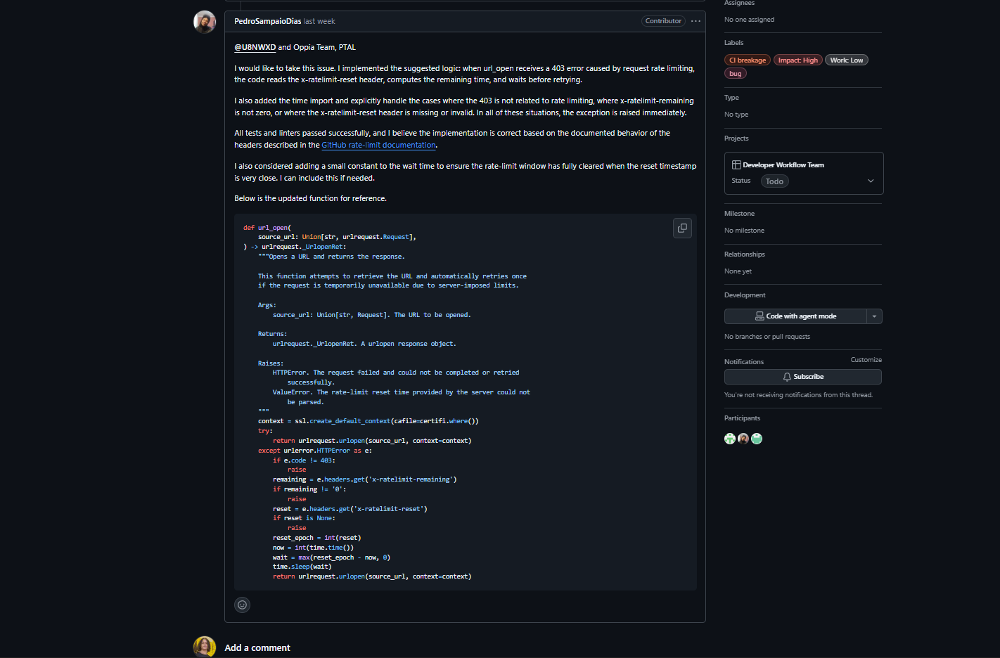
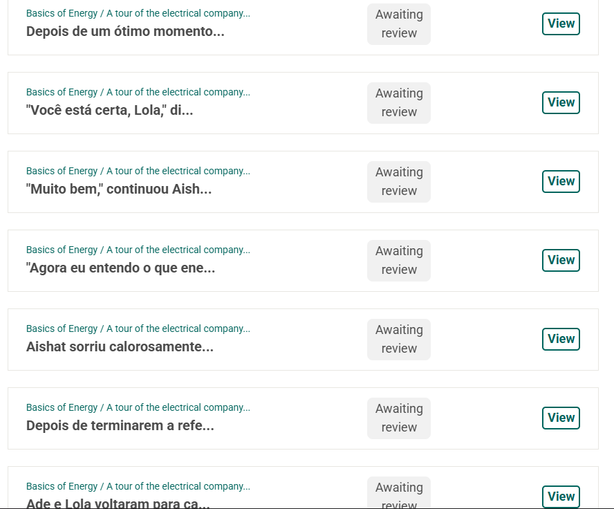

# Diário de Bordo – Nathan Abreu

**Disciplina:** [Gestão da Configuração e Evolução de Software]  
**Equipe:** [Oppia]  
**Comunidade/Projeto de Software Livre:** [Oppia]

---

## Sprint 0 – [25/08 – 10/09]

### Resumo da Sprint

Essa sprint foi focada em organizar a equipe, criar o fork e o repositório de documentação, além de estudar as políticas de contribuição e práticas de GCES do Oppia. Também realizei a configuração do ambiente local, documentando os problemas e aprendizados adquiridos durante o processo.

### Atividades Realizadas

| Data  | Atividade | Tipo (Código/Doc/Discussão/Outro) | Link/Referência | Status |
| ----- | ---------- | --------------------------------- | --------------- | ------ |
| 25/08 | Estudo do manual de contribuição | Estudo | [Link](https://github.com/oppia/oppia/wiki) | Concluído |
| 09/09 | Fork do repositório do projeto | Código | [Link](https://github.com/Maliz30/oppia) | Concluído |
| 09/09 | Envio do termo de licença de contribuição (CLA) | Formulário | [Link](https://docs.google.com/forms/d/e/1FAIpQLSfoFLKT4BlNH2937mSMJATVaWq-yBSrq8p3jjrPwcMw3gaGcg/viewform?c=0&w=1) | Concluído |
| 09/09 | Leitura das normas de conduta do projeto | Estudo | [Link](https://github.com/oppia/oppia/blob/develop/.github/CODE_OF_CONDUCT.md) | Concluído |
| 09/09 | Resposta ao formulário de contribuição individual | Formulário | [Link](https://docs.google.com/forms/u/0/d/e/1FAIpQLSfiOd5WQp--PlbKAPmPLF14m0Ix2nTPwth9nb_48AHDv9fauw/formResponse) | Concluído |
| 09/09 | Instalação e configuração do ambiente no Linux | Código | [Link](https://github.com/oppia/oppia/wiki/Installing-Oppia-%28Linux%3B-Python-3%29) | Concluído |
| 09/09 | Registro do diário de bordo individual da Sprint 0 | Doc | - | Concluído |

### Maiores Avanços

* Completei o envio do termo de licença de contribuição e do questionário individual.  
* Fiz a leitura das principais documentações e políticas de conduta do projeto.  
* Consegui configurar o ambiente de desenvolvimento local.  
* Registrei o processo no repositório do grupo.  

### Maiores Dificuldades

* Dificuldade em equilibrar as demandas da disciplina com outras atividades.  
* Volume alto de informações iniciais para compreender em pouco tempo.  

### Aprendizados

* Entendimento sobre a estrutura e organização de um repositório open source.  
* Maior clareza sobre as etapas iniciais de colaboração em projetos de código aberto.  

### Plano Pessoal para a Próxima Sprint

* [x] Procurar *good first issues* para começar a contribuir.  
* [x] Resolver a primeira issue e documentar o processo.  
* [x] Engajar-se mais nas reuniões e atividades da equipe GCES.  

---

## Sprint 1 – [10/09 – 24/09]

### Resumo da Sprint

Essa sprint foi focada em realizar a primeira contribuição efetiva no código da comunidade Oppia. Encontrei a issue **#23387**, que solicitava a substituição de imagens de baixa qualidade por versões aprimoradas. Subi o ambiente, produzi uma nova imagem com as logos dos parceiros e validei a correção localmente. Após isso, iniciei o contato com o mantenedor do projeto para aprovação e posterior abertura do Pull Request.

### Atividades Realizadas

| Data | Atividade | Tipo (Código/Doc/Discussão/Outro) | Link/Referência | Status |
| ----- | ---------- | --------------------------------- | --------------- | ------ |
| 15/09 | Estudo da issue e análise de PRs relacionados | Estudo | [Issue #23387](https://github.com/oppia/oppia/issues/23387#issuecomment-3329681531) | Concluído |
| 21/09 | Identificação dos arquivos de imagem relevantes | Código | `partners15x.png`, `partners15x.webp` | Concluído |
| 22/09 | Criação de imagem aprimorada no Canva com logos dos parceiros | Código | - | Concluído |
| 23/09 – 24/09 | Discussão e interação com o maintainer @mon4our | Discussão | [Issue #23387](https://github.com/oppia/oppia/issues/23387#issuecomment-3329681531) | Em andamento |
| 26/09 | Aguardando *assignee* da issue para submissão do PR | Outro | - | Pendente |

### Maiores Avanços

* Entrei em contato direto com a equipe Oppia.  
* Criei e substituí imagens de forma bem-sucedida, resolvendo a issue localmente.  
* Consegui entender melhor o fluxo de contribuição e a interação com os mantenedores.  
* Registrei todo o processo no repositório do grupo.  

Antes:  
  

Depois:  
  

### Maiores Dificuldades

* Comunicação e alinhamento com a equipe de GCES.  
* Demora no processo de *assignment* da issue por parte do maintainer.  

### Aprendizados

* Navegação e entendimento de um projeto open source de grande escala.  
* Familiarização com o processo de contribuição e validação de PRs.  

### Plano Pessoal para a Próxima Sprint

* [x] Resolver uma nova issue no projeto.  
* [x] Colaborar para a criação de alguma questão para o Oppia.  
* [x] Engajar-se de forma mais participativa nas reuniões da equipe da disciplina de GCES.

---

## Sprint 2 – [25/09 – 08/10]

### Resumo da Sprint

Durante esta sprint adicionei o aluno Pedro Sampaio ao meu fork para trabalharmos juntos na issue, ajustei a posição da imagem e subi a versão corrigida para o fork principal, e iniciamos o Pull Request que aguarda aprovação. A issue trabalhada foi a #23387 (substituição de imagens).

### Atividades Realizadas

| Data | Atividade | Tipo (Código/Doc/Discussão/Outro) | Link/Referência | Status |
| ----- | ---------- | --------------------------------- | --------------- | ------ |
| 25/09 | Adição de Pedro Sampaio ao fork para pair programming | Outro |  [Issue #23387](https://github.com/oppia/oppia/issues/23387)  | Concluído |
| 27/09 | Ajuste da posição da imagem e upload para o fork principal | Código |  [Issue #23387](https://github.com/oppia/oppia/issues/23387)  | Concluído |
| 30/09 | Início do Pull Request e interação na issue | Código/Discussão | [Issue #23387](https://github.com/oppia/oppia/issues/23387) | Em andamento |

### Maiores Avanços

* Integração do Pedro no fluxo de trabalho do fork para trabalharmos em pair programming.  
* Correção e reposicionamento da imagem no repositório forkado.  
* Abertura do PR iniciando o processo de revisão pelos mantenedores.

### Maiores Dificuldades

* Coordenação do trabalho em pair com revisão e sincronização de commits.  
* Aguardar a triagem/assign do maintainer e a aprovação do PR.

### Aprendizados

* Práticas de colaboração em pair programming dentro de um fork.  
* Fluxo de atualização de assets (imagens) e como preparar o PR para revisão.

### Evidência da Conversa na Issue

### Plano Pessoal para a Próxima Sprint

* [x] Começar as contribuições de tradução no repositório.  
* [x] Finalizar o Pull Request iniciado nesta sprint (concluído posteriormente na Sprint 3).

---

## Sprint 3 – [09/10 – 21/10]

### Resumo da Sprint

Nessa sprint finalizei o Pull Request relacionado ao Oppia após resolver a pipeline de testes que estava bloqueando a integração. Também iniciei contribuições de traduções para o repositório (adaptação de strings e revisão de arquivos de locale) e registrei os primeiros commits de tradução. O link do PR finalizado está abaixo.

### Atividades Realizadas

| Data | Atividade | Tipo (Código/Doc/Discussão/Outro) | Link/Referência | Status |
| ----- | ---------- | --------------------------------- | --------------- | ------ |
| 12/10 | Resolução da pipeline de testes e finalização do PR | Código | [PR #23560](https://github.com/oppia/oppia/pull/23560#issuecomment-3425653565) | Concluído |
| 15/10 | Início da contribuição de traduções (strings e arquivos locale) | Código/Doc | Imagem 01 | Em andamento |
| 21/10 | Planejamento de próxima issue em pair programming com Pedro | Discussão/Outro | imagem 02| Pendente |

### Maiores Avanços

* Finalização do PR após corrigir falhas na pipeline de testes. Link: https://github.com/oppia/oppia/pull/23560#issuecomment-3425653565  
* Início efetivo das contribuições de tradução no repositório.  
* Registro dos passos e commits iniciais para facilitar revisão por mantenedores.

### Maiores Dificuldades

* Ajustes na pipeline de testes que exigiram depuração de integração contínua.  
* Organização das traduções entre diferentes arquivos de locale e garantir consistência.

### Aprendizados

* Como investigar e corrigir falhas na pipeline de testes do projeto.  
* Boas práticas ao iniciar contribuições de tradução (naming, contexto das strings, revisão).

### Contribuições de Tradução

Ainda em andamento — espaço reservado para adicionar evidências visuais (prints/capturas) das minhas contribuições de tradução:

### Plano Pessoal para a Próxima Sprint

* [ ] Encontrar uma issue para trabalhar em pair programming com o Pedro.  
* [ ] Continuar as contribuições de tradução e completar revisão de strings pendentes.  
* [ ] Abrir PRs menores para facilitar revisão e integração contínua.

---

## Sprint 4 – [22/10 – 05/11]

### Resumo da Sprint

Na Sprint 4 analisei o feedback das revisões das traduções submetidas e realizei novas contribuições de tradução em respostas às correções solicitadas. Busquei ajustar detalhes de formatação e o contexto entre falas dos personagens para manter a coerência pedagógica.

### Atividades Realizadas

| Data | Atividade | Tipo | Link/Referência | Status |
| ---- | --------- | ---- | --------------- | ------ |
| 23/10 | Análise de feedbacks das traduções | Doc/Discussão | - | Concluído |
| 27/10 | Submissão de novas traduções e correções | Código/Doc | - | Concluído |
| 04/11 | Revisão de contexto entre personagens | Doc | - | Concluído |

### Maiores Avanços

* Submissão de várias correções solicitadas pelos revisores.  
* Melhoria no detalhamento das interações entre personagens nas lições.

### Maiores Dificuldades

* Falta de comunicação consistente por parte dos avaliadores; respostas demoradas ou ausentes.

### Aprendizados

* Importância de detalhar o contexto e entonação nas traduções para preservar a intenção pedagógica.

### Evidência / Captura

---

## Sprint 5 – [06/11 – 20/11]

### Resumo da Sprint

Na Sprint 5 corrigi questões apontadas pelos revisores (como a falta de negrito em termos destacados) e, em parceria com o Pedro Sampaio, finalizamos a tradução do bloco "Energia Básica" com aproximadamente 150 traduções realizadas no período.

### Atividades Realizadas

| Data | Atividade | Tipo | Link/Referência | Status |
| ---- | --------- | ---- | --------------- | ------ |
| 08/11 | Correção de negrito em palavras destacadas | Código/Doc | - | Concluído |
| 12/11 – 18/11 | Tradução e revisão do bloco "Energia Básica" (em pair) | Doc/Código | - | Concluído |

### Maiores Avanços

* Conclusão do bloco "Energia Básica" (≈150 traduções) com revisão em pair programming.

### Maiores Dificuldades

* Feedbacks dos revisores frequentemente pouco detalhados, exigindo refinamentos adicionais.

### Aprendizados

* Pair programming ordenado facilita divisão de tarefas e revisão cruzada eficiente.

### Evidência / Captura

---

## Sprint 6 – [21/11 – 05/12]

### Resumo da Sprint

Na Sprint 6, eu e Pedro Sampaio resolvemos um bug de CI relacionado ao fluxo de integração e continuamos com contribuições de tradução. Realizamos cerca de 15 traduções adicionais e finalizamos as traduções de "Energia Renovável". A issue trabalhada está em: https://github.com/oppia/oppia/issues/23905 — aguardando aprovação e atribuição (assignee).

### Atividades Realizadas

| Data | Atividade | Tipo | Link/Referência | Status |
| ---- | --------- | ---- | --------------- | ------ |
| 22/11 | Investigação e correção do bug de CI | Código | [Issue #23905](https://github.com/oppia/oppia/issues/23905) | Em andamento |
| 24/11 – 02/12 | Traduções finais de "Energia Renovável" (≈15 traduções) | Doc | - | Concluído |
| 03/12 | Submissão de PRs e pedido de assignee para revisão final | Código/Discussão | [Issue #23905](https://github.com/oppia/oppia/issues/23905) | Pendente |

### Maiores Avanços

* Correção aplicada para o bug de CI (implementação submetida).  
* Finalizamos as traduções do módulo "Energia Renovável".  
* Avanço em colaboração com Pedro no fluxo de revisão.

### Maiores Dificuldades

* Falta de aprovação/assign por parte de alguns maintainers (time externo), o que atrasou o fechamento da issue.

### Aprendizados

* Trabalhar em projetos open source requer adaptação a processos de revisão externos e paciência na espera por respostas.  
* Pair programming permitiu resolver tanto traduções quanto problemas de integração.

### Evidências / Capturas

### Novas Traduções (evidência)

### Plano Pessoal para a Próxima Sprint

* [ ] Acompanhar aprovação/assign da issue #23905.  
* [ ] Continuar revisões de traduções pendentes e responder feedbacks dos revisores.  
* [ ] Submeter pequenos PRs de correção para acelerar a aceitação.
