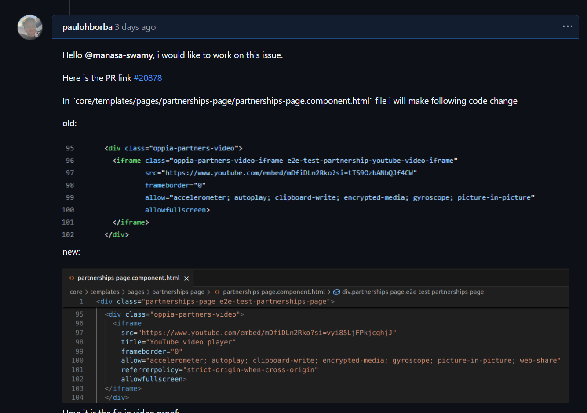
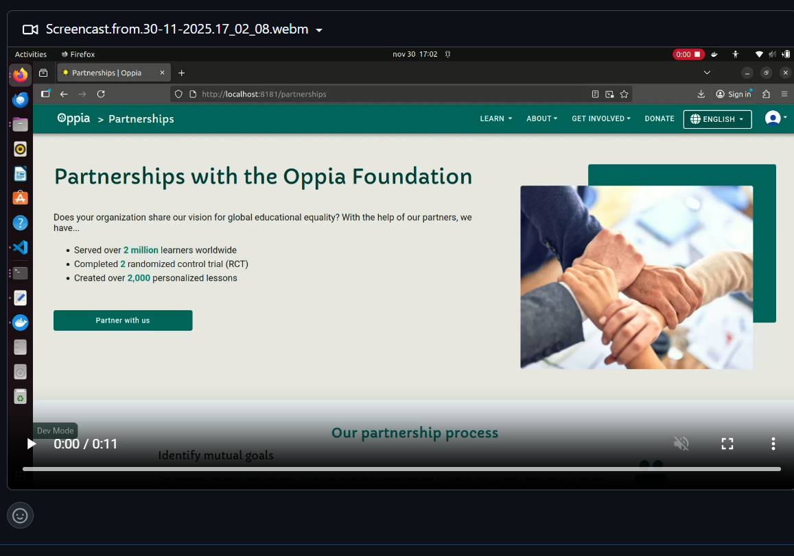
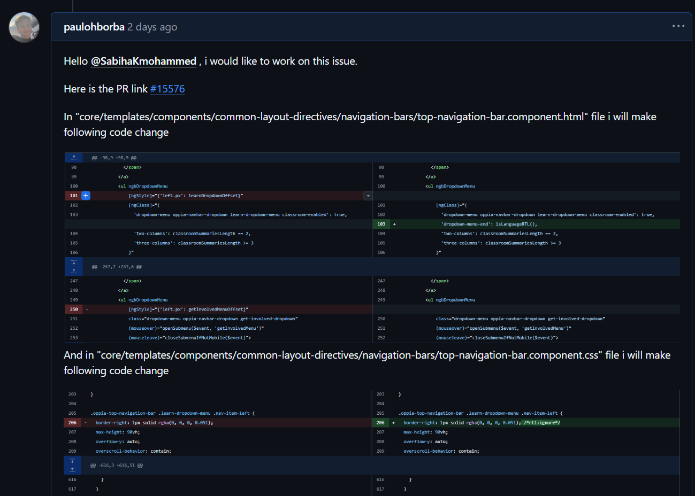
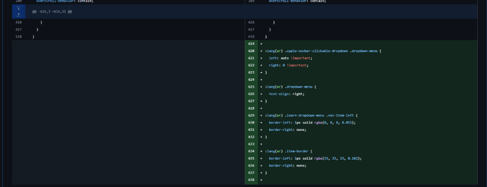
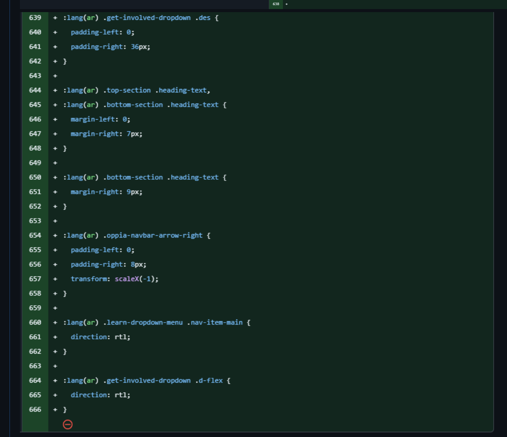
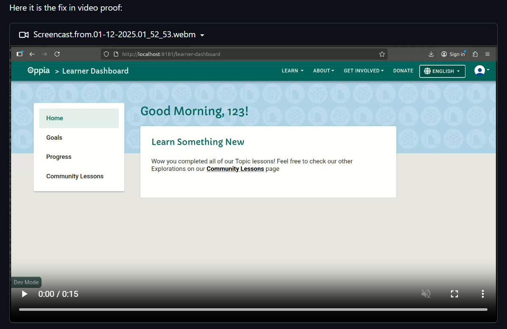
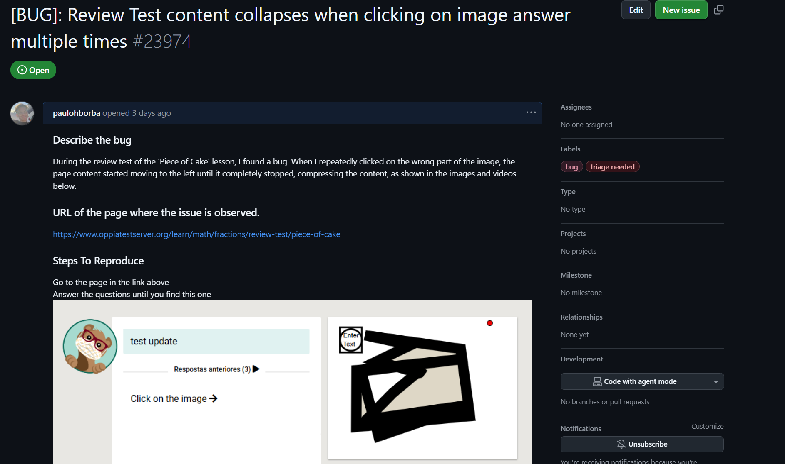

# Diário de Bordo – \[Paulo Henrique Rossi de Borba]

**Disciplina:** \[Gestão da Configuração e Evolução de Software]
**Equipe:** \[Oppia]
**Comunidade/Projeto de Software Livre:** \[Oppia]

---

## Sprint 0 – \[25/08 – 10/09]

### Resumo da Sprint

Nesta Sprint 0, o foco principal foi a imersão no projeto Oppia, compreendendo sua estrutura, diretrizes de contribuição e configuração do ambiente de desenvolvimento. Foram realizadas leituras essenciais, preenchidos formulários de contribuição e iniciado o processo de configuração do ambiente local.

### Atividades Realizadas

| Data  | Atividade | Tipo (Código/Doc/Discussão/Outro) | Link/Referência | Status |
| ----- | --------- | --------------------------------- | --------------- | ------ |
| 29/08 | Leitura e estudo do repositório do Oppia e guia de contribuição | Estudo                            | [Link](https://github.com/oppia/oppia/wiki/Overview-of-the-Oppia-codebase) | Concluído |
| 02/09 | Preenchimento do formulário de contribuição | Formulário |  [Link](https://docs.google.com/forms/d/e/1FAIpQLSfoFLKT4BlNH2937mSMJATVaWq-yBSrq8p3jjrPwcMw3gaGcg/viewform?c=0&w=1) | Concluído |
| 02/09 | Preenchimento do segundo formulário de contribuição | Formulário |  [Link](https://docs.google.com/forms/d/e/1FAIpQLSfiOd5WQp--PlbKAPmPLF14m0Ix2nTPwth9nb_48AHDv9fauw/viewform) | Concluído |
| 09/09 | Criação do fork do projeto | Código | [Link](https://github.com/paulohborba/oppia) | Concluído |
| 09/09 | Configuração do ambiente de desenvolvimento | Código | [Link](https://github.com/oppia/oppia/wiki/Installing-Oppia-%28Linux%3B-Python-3%29)   | Concluído |
| 09/09 | Criação do Diário de Bordo | Doc | (Página atual) | Concluído |

### Maiores Avanços

* Consegui entender o funcionamento do projeto, como as políticas de contribuição, qualidade e comunicação da comunidade Oppia.

* Os dois formulários para contribuição do projeto foram preenchidos.

* Consegui rodar o projeto localmente, apesar de ainda precisar de alguns ajustes.

* A equipe conseguiu se organizar de uma forma adequada.

### Maiores Dificuldades

* A configuração do ambiente de desenvolvimento teve diversos problemas.

* A configuração do ambiente de desenvolvimento ainda não está no nível que gostaria, mas espero conseguir ajustar.

### Aprendizados

* Consegui entender melhor o funcionamento de um projeto opensource de grande escala.

* Aprendi um pouco mais sobre configuração de ambientes de desenvolvimento.

### Plano Pessoal para a Próxima Sprint

* [ ] Ajustar o ambiente de desenvolvimento para ficar de acordo com minhas expectativas.
* [ ] Buscar issues "introdutórias" que me preparem para a integralização ao projeto.
* [ ] Melhorar a documentação pessoal e do grupo.
* [ ] Participar ativamente nas discussões, resoluções e dúvidas do grupo.

## Sprint 1 – \[10/09 – 24/09]

### Resumo da Sprint

Nesta Sprint 1, o foco principal foi novamente a imersão no projeto Oppia, compreendendo sua estrutura, diretrizes de contribuição, configuração do ambiente de desenvolvimento e também compreender melhor a contribuição de issues. Foi necessário refazer a configuração do ambiente de desenvolvimento.

### Atividades Realizadas

| Data  | Atividade | Tipo (Código/Doc/Discussão/Outro) | Link/Referência | Status |
| ----- | --------- | --------------------------------- | --------------- | ------ |
| 12/09 | Nova configuração do ambiente de desenvolvimento | Código |  [Link](https://github.com/oppia/oppia/wiki/Installing-Oppia-%28Linux%3B-Python-3%29) | Concluído |
| 15/09 | Entendimento sobre o funcionamento dos PRs | Estudo | [Link](https://github.com/oppia/oppia/wiki/Rules-for-making-PRs) | Concluído |
| 20/09 | Avaliando a primeira Issue para trabalhar| Estudo | - | Em andamento |

### Maiores Avanços

* Avanço no entendimento das diretrizes de Pull Request (PR) da comunidade Oppia

* Consegui configurar instalação na minha máquina.

* Revisão e refinamento do conhecimento sobre a arquitetura (frontend/backend).

### Maiores Dificuldades

* Persistência de conflitos de dependência no ambiente local (Python/Node).

* Grande curva de aprendizado necessária para entender o fluxo completo de contribuição em um projeto de grande porte.

### Aprendizados

* Dominar a configuração do ambiente (mesmo que instável) é o primeiro passo para contribuição efetiva.

* A leitura da documentação de PRs e guias de contribuição é crucial antes de iniciar o código.

### Plano Pessoal para a Próxima Sprint
* [ ] Finalizar a migração da configuração para Docker e estabilizar o ambiente.
* [ ] Escolher e reservar uma good first issue para começar.

## Sprint 2 – \[25/09 – 08/10]

### Resumo da Sprint

Nesta Sprint 2, foi necessário novamente ampliar a configuração do ambiente de desenvolvimento utilizando o docker dessa vez. O estudo sobre quais issues seriam ideais para começar, como contribuir e o início da realização dessa issue.

### Atividades Realizadas

| Data  | Atividade | Tipo (Código/Doc/Discussão/Outro) | Link/Referência | Status |
| ----- | --------- | --------------------------------- | --------------- | ------ |
| 12/09 | Configuração do ambiente de desenvolvimento utilizando Docker | Código |  [Link](https://github.com/oppia/oppia/wiki/Installing-Oppia-using-Docker) | Concluído |
| 15/09 | Entendimento sobre as issues ideais para começar | Estudo | [Link](https://github.com/oppia/oppia/issues?q=is%3Aopen+is%3Aissue+label%3A%22good+first+issue%22) | Concluído |
| 20/09 | Avaliando a primeira Issue para trabalhar| Estudo | [Link](https://github.com/oppia/oppia/issues/20003) ou [Link](https://github.com/oppia/oppia/issues/19763) | Em andamento |

### Maiores Avanços

* Identificação da necessidade de migrar para Docker devido à instabilidade do ambiente local.

* Configuração e build bem-sucedidos do ambiente com Docker, superando os desafios de dependência.

* Definição da primeira Issue a ser trabalhada, marcando a transição de estudo para contribuição.

### Maiores Dificuldades

* O tempo gasto para resolver erros durante o build do Docker.

* Selecionar uma boa primeira Issue a ser trabalhada.

### Aprendizados

* A importância da virtualização (Docker) para isolar e padronizar ambientes complexos como o Oppia.

### Plano Pessoal para a Próxima Sprint
* [ ] Finalizar a implementação da Issue escolhida.
* [ ] Criar o Pull Request (PR) seguindo rigorosamente as diretrizes da comunidade Oppia.
* [ ] Revisar e responder aos comentários de reviewers do PR de forma proativa.
* [ ] Tentar começar ou fazer mais uma issue.

# Diário de Bordo – \[Luiza Maluf Amorim]

**Disciplina:** \[Gestão da Configuração e Evolução de Software]
**Equipe:** \[Oppia]
**Comunidade/Projeto de Software Livre:** \[Oppia]

---

## Sprint 3 – [09/10 – 21/10]

### Resumo da Sprint

### Atividades Realizadas

| Data           | Atividade                                                   | Tipo (Código/Doc/Discussão/Outro) | Link/Referência | Status        |
| -------------- | ----------------------------------------------------------- | --------------------------------- | --------------- | ------------- |
| 09/10 – 21/10  | Investigação e tentativa de pre-push após alterações no backend` | Código | [Issue link](https://github.com/oppia/oppia/issues/22727) | Concluído    |
| 20/10         | Registro das dificuldades no Discussions do Oppia            | Discurssão | [#23646](https://github.com/oppia/oppia/discussions/23646), [#23633](https://github.com/oppia/oppia/discussions/23633), [#23631](https://github.com/oppia/oppia/discussions/23631) | Aguardando resposta     |
| 21/09  | Documentação do fluxo de problemas e próximos passos                 | Doc | Diário de Bordo | Concluído     |

### Maiores Avanços

- Remoção do parâmetro SERVER_CAN_SEND_EMAILS implementada no código e nos testes locais.

- Identificação dos principais erros bloqueando o pre-push e possíveis causas:

    -   Backend: testes falhando (ImportError, too many positional arguments, unused variables).

    -   WSL: problemas de permissão no node_modules.

    -   Docker: build quebrando devido ao Debian Buster descontinuado.

- Discussões abertas no repositório oficial para suporte e orientação dos maintainers.

### Maiores Dificuldades

- Falhas no pre-push que impediram a submissão do PR.

- Dependência dos maintainers para definir como corrigir erros de backend e CI/CD.

- Problemas de ambiente (WSL e Docker) que atrasaram o fluxo de contribuição.  

### Aprendizados

- Compreensão mais profunda do pipeline de testes, linting e CI/CD do Oppia.

- Experiência em documentar e comunicar problemas técnicos complexos à comunidade.

- Aprendizado prático em lidar com erros de integração em ambientes variados.

### Plano Pessoal para a Próxima Sprint

* [ ] Acompanhar a resposta dos maintainers sobre os bloqueios no pre-push. 
* [ ] Corrigir erros de linting e testes backend conforme orientação.
* [ ] Submeter finalmente o PR da issue #22727.

## Sprint 4 – [22/10 – 05/11]

### Resumo da Sprint

Esta seção documenta a tentativa de contribuição para o projeto Oppia focada na Issue #23686 (Add new field to exploration commit log in ExplorationCommitModel). O trabalho envolveu a análise e implementação da solução proposta, resultando em um commit local. Embora a issue tenha sido atribuída a outro colaborador durante a fase de implementação, a experiência foi valiosa para a familiarização com o fluxo de trabalho de contribuição e a estrutura do código-base.

### Atividades Realizadas
| Data	| Atividade	| Tipo	| Link/Referência	| Status |
|----|-----|-----|----|----|
|22/10 – 29/10|	Análise da Issue | 	Estudo | [Issue #23686](https://github.com/oppia/oppia/issues/23686) | Concluído | 
|31/10	|Tentativa de reorganizar ambiente e revalidar erros| Código| [ Commit local da issue #23686](https://github.com/paulohborba/oppia/commit/200e8ce5e1174be1817a7e82bc7c421c6f95d817) |	Concluído |
|31/10	| Análise da situação da issue |  [Issue #23686](https://github.com/oppia/oppia/issues/23686) | - |	Concluído |
|31/10	| Issue constatada com Assigned para outra pessoa |  [Issue #23686](https://github.com/oppia/oppia/issues/23686) | - |	Concluído |

### Maiores Avanços

Familiarização com o Fluxo: A atividade serviu como um excelente exercício prático para entender o processo de seleção de issues, codificação e preparação de um commit em um projeto Open Source de grande escala.

Implementação Concluída (Local): Consegui realizar a implementação da solução proposta na issue, com o código pronto para ser submetido.

### Maiores Dificuldades

Tempo de Atribuição: A principal dificuldade foi o tempo da comunidade para atribuição da issue. Ela foi atribuída a outra pessoa enquanto eu estava finalizando a implementação, o que resultou na impossibilidade de submeter meu Pull Request (PR).

### Aprendizados

Agilidade na Comunidade: A experiência ressaltou a importância da agilidade em projetos Open Source concorridos, tanto na comunicação para solicitar a atribuição da issue quanto na implementação.

Não Desistir: Mesmo não resultando em um PR aprovado, o processo de codificação e análise do problema foi um aprendizado valioso.

### Plano Pessoal para a Próxima Sprint

* [ ] Focar em issues de baixo risco/menor complexidade inicialmente para aumentar a chance de PRs serem aceitos rapidamente.
* [ ] Comunicar imediatamente o início da resolução da issue no tópico correspondente e solicitar a atribuição.
* [ ] Buscar issues com a label good first issue para solidificar a base de contribuição.

## Sprint 5 – [06/11 – 20/11]
### Resumo da Sprint

Após a busca, foi identificada a Issue #23682, que relata um bug de visualização de vídeo na página de Parcerias. O problema é que o tile de vídeo incorporado mostra o erro “Error 153: Video player configuration error”, embora o vídeo funcione corretamente ao ser acessado diretamente no YouTube.

### Atividades Realizadas
| Data	| Atividade	| Tipo	| Link/Referência	| Status |
|----|-----|-----|----|----|
| 08/11	| Análise da Issue #23682 |	Estudo | [Issue #23682](https://github.com/oppia/oppia/issues/23682) |Concluído|
| 09/11	| Análise e Reprodução do Bug |	Código | [Issue #23682](https://github.com/oppia/oppia/issues/23682)	|Concluído|
| 10/11	| Investigação do Código de Incorporação do Vídeo |	Código | [Issue #23682](https://github.com/oppia/oppia/issues/23682)	| Concluído|
| 15/11	| Início da Implementação da Correção |	Código|	-	| Em andamento |

### Maiores Avanços

Reprodução e Localização do Bug: Consegui reproduzir o erro no ambiente local e localizar o componente de front-end responsável pela incorporação do player de vídeo na página de Parcerias.

Diagnóstico Inicial: A causa do "Error 153" foi diagnosticada como um erro de configuração do player do YouTube ou restrições de embed que podem ser resolvidas ajustando os parâmetros de incorporação.

### Maiores Dificuldades

Debugging de iFrames e Embeds: A resolução de erros de embed de terceiros (como o YouTube) exige cautela para garantir que a correção não introduza problemas de segurança ou compatibilidade com diferentes navegadores.

### Aprendizados

Fluxo de Correção de Bugs: Aprendi o fluxo completo de correção de um bug reportado: reproduzir $\rightarrow$ localizar a causa $\rightarrow$ implementar a correção $\rightarrow$ testar.

### Plano Pessoal para a Próxima Sprint

* [ ] Finalizar a implementação da correção do código.
* [ ] Criar o commit e o Pull Request (PR), solicitando a atribuição formal da Issue #23682.
* [ ] Se possível, buscar outra issue para continuar o aprimoramento em correção.

## Sprint 6 – [21/11 – 05/12]
### Resumo da Sprint

Este período foi marcado pela alta produtividade de código e pela finalização de duas issues, além da contribuição para o issue tracker com a criação de uma nova issue. A Issue #23682 (Bug do vídeo na página de Parcerias) e a Issue #23677 (Melhoria ou Correção) foram completamente implementadas. No entanto, o avanço foi contido pela ausência de resposta dos mantenedores do projeto Oppia, o que impediu a submissão dos Pull Requests (PRs), mesmo após o prazo esperado de 2 dias. Além disso elaborei uma Issue sobre um bug que encontrei enquanto realizava uma dessas Issues.

### Atividades Realizadas

| Data	| Atividade	| Tipo	| Link/Referência	| Status |
|----|-----|-----|----|----|
| 22/11	| Busca e Análise da Issue #23677 |	Doc |  [Issue #23682](https://github.com/oppia/oppia/issues/23682) |	Concluído |
| 30/11	| Finalização da Implementação da Issue #23682 |	Código |  [Issue #23682](https://github.com/oppia/oppia/issues/23682) e [Resolução da Issue #23682](https://github.com/paulohborba/oppia/commit/aed200f998857177a11064df6748aa10d03f7b60) |	Concluído |
| 30/11	| Análise e Implementação da Issue #23677 |	Código | [Issue #23677](https://github.com/oppia/oppia/issues/23677) e [Resolução da Issue #23677](https://github.com/paulohborba/oppia/commit/5798bf709f6e641290dcdfe60c5cf830232dd3e8) |	Concluído |
| 30/11	| Criação e Detalhamento da Nova Issue de número 23974 |	Doc/Discussão |	[Issue #23974](https://github.com/oppia/oppia/issues/23974) | Concluído |
| 30/11	| Tentativas de Contato e Aguardo de Assign  |	Doc| [Issue #23682](https://github.com/oppia/oppia/issues/23682), [Issue #23677](https://github.com/oppia/oppia/issues/23677) e [Issue #23974](https://github.com/oppia/oppia/issues/23974) |	Plataforma Oppia|	Em Andamento |

### Maiores Avanços

Código Pronto para Duas Issues: As implementações para a correção do bug do vídeo (#23682) e para a Issue #23677 foram finalizadas e testadas localmente. O código está pronto para ser enviado.

Aumento da Produtividade: Demonstração de capacidade em alternar e finalizar tarefas rapidamente, comprovando o domínio do ambiente de desenvolvimento e da estrutura do Oppia.

Contribuição ao Tracker: A criação da Issue #23974 demonstra proatividade em identificar e formalizar problemas no projeto, um passo importante na contribuição para a comunidade.

### Maiores Dificuldades

Falta de Resposta e Bloqueio de PR: A maior dificuldade foi a ausência de comunicação dos mantenedores. Mesmo após ultrapassar o prazo usual de 2 dias, não houve resposta para o pedido de atribuição (assign) das issues, impossibilitando a criação e submissão dos Pull Requests.

### Aprendizados

Canais Alternativos de Comunicação: É crucial explorar canais de comunicação secundários (como mailing lists ou canais de chat) para evitar que a inatividade no GitHub bloqueie o fluxo de trabalho.

Adaptação ao Ritmo da Comunidade: Mesmo com o código pronto, o processo de contribuição está sempre sujeito ao ritmo e à disponibilidade dos revisores e mantenedores. A próxima etapa é aprender a lidar com esse tempo de espera de forma mais eficiente.