# Diário de Bordo – Pedro Sampaio Dias Rocha

**Disciplina:** [Gestão da Configuração e Evolução de Software]
**Equipe:** [Oppia]
**Comunidade/Projeto de Software Livre:** [Oppia]

---

## Sprint 0 – [25/08 – 10/09]

### Resumo da Sprint

Nesta sprint, voltamos nossos esforços para estruturar a equipe, criar o fork do projeto e organizar o repositório de documentação. Também estudamos as diretrizes de contribuição e as práticas de GCES utilizadas pelo Oppia, além de iniciar a busca por issues a serem trabalhadas. Um ponto central desta etapa foi a configuração do ambiente local, atividade essencial para o andamento do projeto.

### Atividades Realizadas

| Data  | Atividade | Tipo (Código/Doc/Discussão/Outro) | Link/Referência | Status |
| ----- | --------- | --------------------------------- | --------------- | ------ |
| 01/09 | Criação do fork | Código | [Link](https://github.com/PedroSampaioDias/oppia) | Concluído |
| 01/09 | Leitura e estudo da documentação do projeto | Estudo                            | [Link](https://github.com/oppia/oppia/wiki/Overview-of-the-Oppia-codebase) | Concluído |
| 01/09 | Mapeamento das políticas de contribuição do Oppia | Estudo | [Link](https://github.com/oppia/oppia/wiki) | Concluído |
| 09/09 | Configuração do ambiente linux | Ambiente | [Link](https://github.com/oppia/oppia/wiki/Installing-Oppia-%28Linux%3B-Python-3%29)   | Concluído |
| 09/09 | Entrar no repositório de documentação | Doc |  [Link](https://github.com/LuizaMaluf/GCES-OPPIA-relatorios/tree/docs-pedro-sampaio) | Concluído |

### Maiores Avanços

* Consegui rodar o projeto Oppia localmente.  
* Compreendi melhor as políticas de contribuição, qualidade e comunicação da comunidade Oppia.  
* Identifiquei algumas possíveis *issues* no repositório.  

### Maiores Dificuldades

* Foi trabalhoso corrigir um problema de versionamento do ambiente virtual (*venv*), que já existia previamente no meu computador.  

### Aprendizados

* Percebi a importância de seguir rigorosamente a documentação oficial para evitar erros de configuração.  
* Tive meu primeiro contato com a leitura de uma documentação de contribuição em projetos de código aberto, o que me permitiu compreender melhor como funciona esse processo.  

### Plano Pessoal para a Próxima Sprint

* [ ] Buscar issues relevantes para contribuir.

---

## Sprint 1 – [11/09 – 24/09]

### Resumo da Sprint

Nesta sprint, o objetivo foi, em primeiro lugar, explorar com mais profundidade as formas de contribuição disponíveis no projeto. Em seguida, buscou-se mapear as possibilidades de participação tanto na parte de código quanto na criação de lições. Por fim, caso fosse viável, a meta também incluía realizar uma primeira contribuição prática.

### Atividades Realizadas

| Data        | Atividade                                                                 | Tipo (Código/Doc/Discussão/Outro) | Link/Referência                          | Status     |
|-------------|---------------------------------------------------------------------------|------------------------------------|-------------------------------------------|------------|
| 11/09 - 15/09 | Estudo das políticas de contribuição e formas de participação            | Estudo                             | Não resultou em material concreto          | Concluído  |
| 14/09 - 18/09 | Pesquisa de issues para possível contribuição                            | Estudo                             | Não resultou em material concreto          | Concluído  |
| 17/09        | Solicitação de voluntariado para apoiar em implementação ou criação de tarefas | Solicitação                        | [Ver Imagem](./imagens/voluntariado.png)   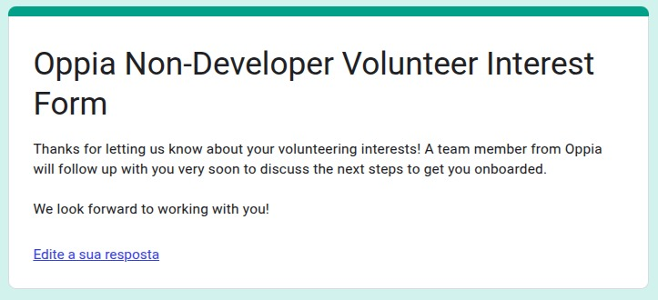 | Concluído  |
| 18/09        | Solicitação de uma issue para contribuição                                | Solicitação                        | Não resultou em material concreto          | Concluído  |

### Maiores Avanços

- Estudo das políticas de contribuição e formas de participação.
- Pesquisa de issues para possível contribuição.
- Solicitação de voluntariado para apoiar em implementação ou criação de tarefas.
- Solicitação de uma issue para contribuição (Ainda não assinado).
- Identificação de boas práticas em processos de submissão de Pull Requests.
- Primeiros testes em ambiente local.

### Maiores Dificuldades

- Identificar uma issue com baixa quantidade de interessados.

### Aprendizados

- Aprendizado sobre como identificar e avaliar issues para potenciais contribuições.
- Maior familiaridade com processos de solicitação e participação voluntária.

### Plano Pessoal para a Próxima Sprint

* [ ] Realizar minha primeira contribuição.

---

## Sprint 2 – [25/09 – 08/10]

### Resumo da Sprint

No início de outubro, comecei a contribuir com o projeto em colaboração com Nathan Abreu, preparando o ambiente de desenvolvimento a partir de um fork e realizando meu primeiro commit logo em seguida. Fui então designado para a issue oficial #23387, e o trabalho desenvolvido culminou na abertura do Pull Request #23560. Durante o processo, enfrentei desafios técnicos com o ambiente local, pois o computador com 16GB de RAM atingiu o limite de memória e travou em algumas ocasiões. Essa experiência, no entanto, gerou aprendizados importantes: compreendi melhor o fluxo de validação de código, incluindo as checagens automáticas no commit e na abertura de PRs, e também investiguei a estrutura de armazenamento de arquivos do blog do projeto. Além das atividades de código, também respondi ao e-mail de solicitação de voluntariado.

### Atividades Realizadas

| Data | Atividade | Tipo | Link/Referência | Status |
| :--- | :--- | :--- | :--- | :--- |
| 03/10 | Iniciei o trabalho no fork do projeto com [Nathan Abreu](https://github.com/nateejpg). | Código | [Link para o Fork](https://github.com/nateejpg/oppia) | Concluído |
| 05/10 | Realizei meu primeiro commit. | Commit | [Link para o Commit](https://github.com/nateejpg/oppia/commit/0d6b65b3e45f1a7258e1201f74a1966eddbad6fa) | Concluído |
| 07/10 | Fui designado para uma issue junto com [Nathan Abreu](https://github.com/nateejpg). | Issue | [Issue #23387](https://github.com/oppia/oppia/issues/23387) | Concluído |
| 07/10 | Respondi ao e-mail sobre a solicitação de voluntariado para apoiar na implementação ou criação de tarefas. | Discussão | [Ver Imagem](./imagens/email_recebido.png)   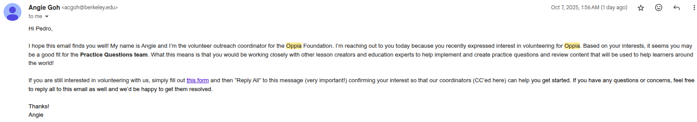 | Aguardando resposta |
| 08/10 | Abri o Pull Request e solicitei o merge. | Pull Request | [PR #23560](https://github.com/oppia/oppia/pull/23560) | Aguardando correções |

### Maiores Avanços

- Preparação do ambiente de desenvolvimento (fork) em colaboração com Nathan Abreu.
- Realização do primeiro commit no fork.
- Designação (assignment) para a primeira issue oficial (#23387).
- Abertura do primeiro Pull Request (#23560).
- Envio da resposta ao e-mail de voluntariado; aguardando a confirmação para estar apto a contribuir com novas questões na plataforma.

### Maiores Dificuldades

- Encontrei dificuldades na execução do projeto: o computador, com 16GB de RAM, atingia o uso máximo de memória, o que causava travamentos completos no sistema e forçava sua reinicialização. O problema ocorreu ao menos duas vezes.

### Aprendizados

- Obtive um melhor entendimento sobre o fluxo de validação de código, incluindo as checagens automáticas no commit (commit hooks) e na abertura de Pull Requests (CI/CD).
- Para obter as imagens necessárias, investiguei e compreendi como o blog do projeto gerencia e armazena esses arquivos.

### Plano Pessoal para a Próxima Sprint

- [ ] Finalizar o Pull Request atual: Acompanhar o PR, implementar os feedbacks da revisão e realizar as alterações necessárias para obter o merge.
- [ ] Contribuir com novo conteúdo: Adicionar um novo item ao banco de conteúdo da plataforma, que pode ser uma questão ou um storytelling.
- [ ] Iniciar uma contribuição mais complexa: Identificar e assumir uma nova issue com um nível de complexidade maior. (Se possível)

---

## Sprint 3 – [09/10 – 21/10]

### Resumo da Sprint
Esta sprint foi marcada pela consolidação das primeiras contribuições diretas ao repositório da Oppia, envolvendo tanto código quanto traduções de conteúdo educativo. O Pull Request relacionado às imagens em baixa resolução foi finalizado e integrado ao projeto após a resolução de problemas no pipeline. Além disso, houve participação ativa no processo de tradução de uma lição completa sobre energia renovável. As contribuições foram reconhecidas pela plataforma com a concessão de badges da comunidade. Como continuidade do trabalho, iniciou-se a identificação de uma nova issue para desenvolvimento em pair programming.

### Atividades Realizadas

| Data | Atividade | Tipo | Link/Referência | Status |
| :--- | :--- | :--- | :--- | :--- |
| 12/10 | Fechamento do Pull Request referente às imagens em baixa resolução, em colaboração com [Nathan Abreu](https://github.com/nateejpg). | Pull Request | [Link para o PR](https://github.com/oppia/oppia/pull/23560) | Concluído |
| 12/10 | Realização do merge do Pull Request. | Merge | [Link para o commit](https://github.com/oppia/oppia/commit/30d483afaa3bff758dd0c42248e05be5624e6f8f) | Concluído |
| 12/10 a 15/10 | Tradução da atividade “Renewable and Non-renewable Energy.” | Tradução | [Ver Imagem](./imagens/comprovacao_traducao_1.png)   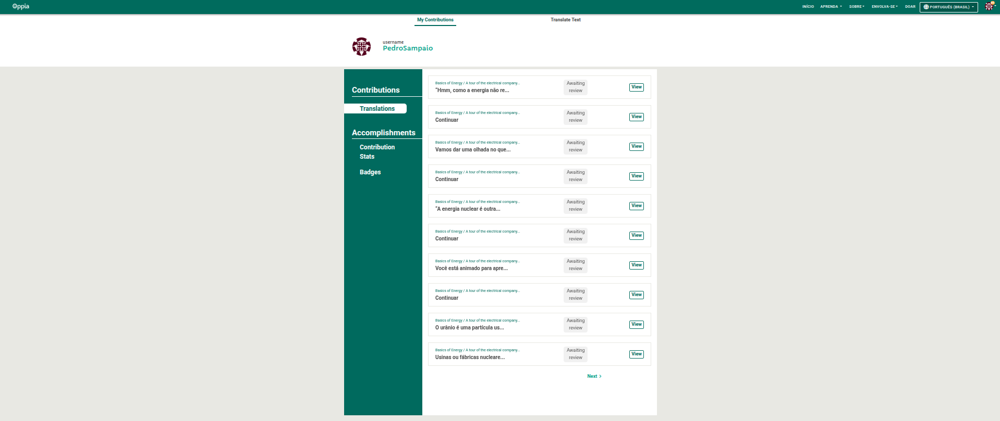 | Concluído |
| 20/10 | Traduções aprovadas pela comunidade. | Tradução | [Ver Imagem](./imagens/comprovacao_traducao_3.png)   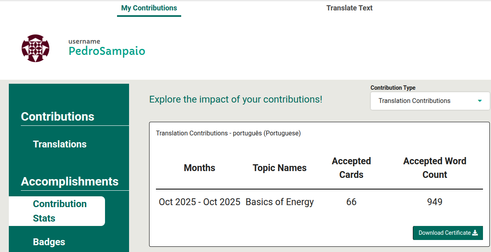   [Ver Imagem](./imagens/comprovacao_traducao_4.png)   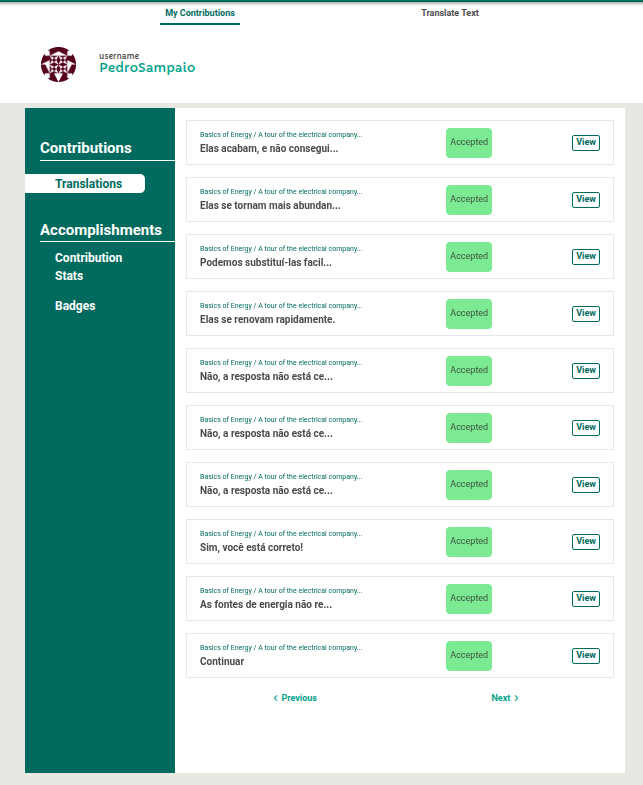   [Ver Imagem](./imagens/comprovacao_traducao_2.png)   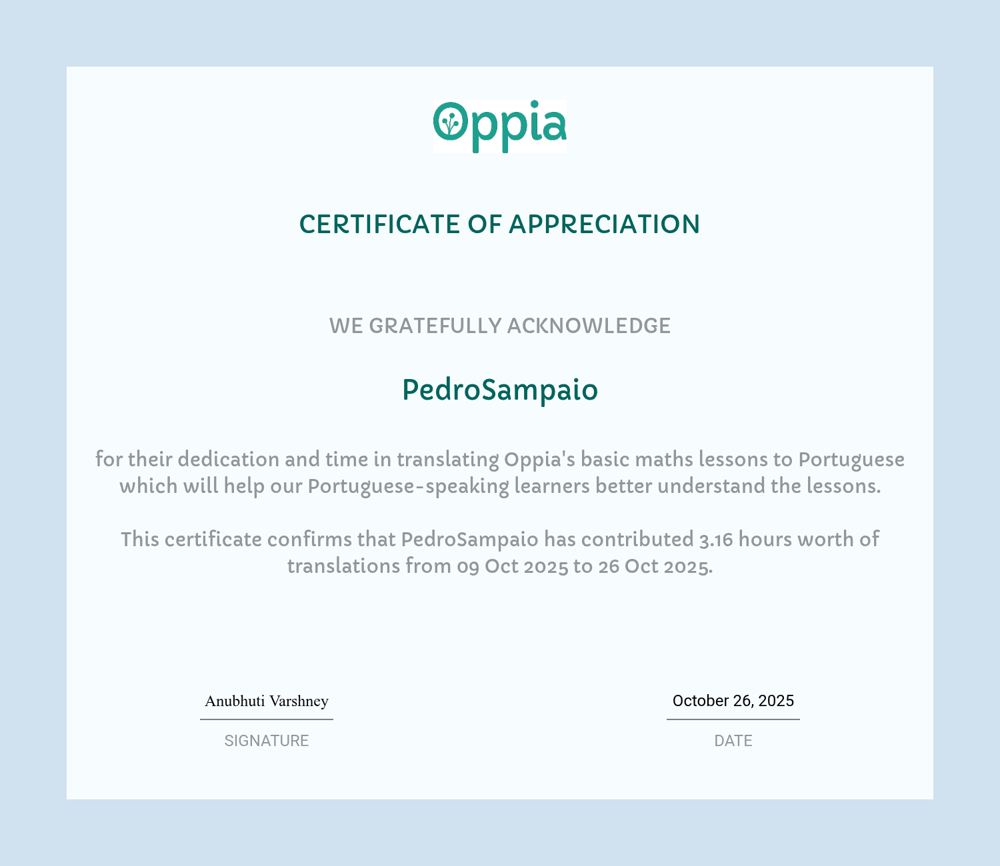 | Concluído |
| 20/10 | Recebimento de badges da comunidade Oppia pelas traduções aprovadas. | Reconhecimento | [Ver Imagem](./imagens/comprovacao_traducao_5.png)   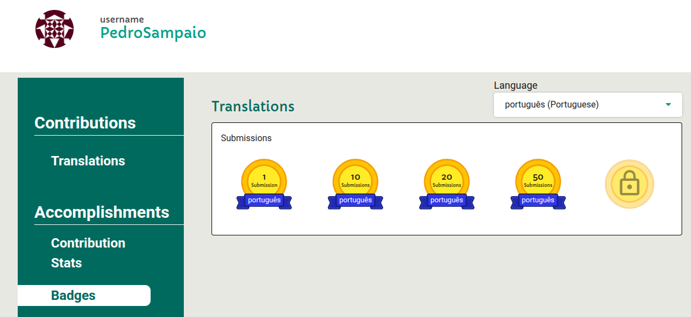 | Concluído |
| 21/10 | Início da busca por uma nova issue para desenvolvimento em pair programming com [Nathan Abreu](https://github.com/nateejpg). | Issue | Sem comprovantes | Em andamento |

### Maiores Avanços

- Primeira contribuição em código para o projeto: [Link para o PR](https://github.com/oppia/oppia/pull/23560).
- Primeira contribuição em traduções no projeto. Em colaboração com [Nathan Abreu](https://github.com/nateejpg), realizamos grande parte da tradução de uma lição sobre energia renovável. O conteúdo estava com 0% traduzido no início da sprint e atualmente apresenta 52% traduzido, com outros 40% já enviados para revisão. Após a aprovação, a atividade alcançará 92% de tradução concluída. Determinadas partes não foram traduzidas devido às dificuldades com a ferramenta de edição de imagens do projeto.
- Recebimento de badges oficiais da comunidade por traduções aprovadas.

### Maiores Dificuldades

- Dificuldades no pipeline do Pull Request, o que exigiu quase uma semana para identificar e corrigir o problema.
- Comunicação lenta com a equipe de revisão, com respostas demoradas que impactam o andamento das validações.

### Aprendizados

- Melhor compreensão do fluxo de tradução e criação de questões no projeto, complementando o aprendizado técnico com o repositório.
- Aperfeiçoamento das práticas relacionadas ao processo de revisão e aprovação de Pull Requests no projeto Oppia.

### Plano Pessoal para a Próxima Sprint

- [ ] Iniciar uma contribuição de maior complexidade, assumindo uma nova issue mais desafiadora (se possível).
- [ ] Acompanhar a revisão das traduções pendentes e realizar ajustes caso necessário.

---

## Sprint 4 – [22/10 – 05/11]

### Resumo da Sprint

Nesta sprint, os esforços foram concentrados na continuidade das contribuições de conteúdo para a plataforma Oppia. O foco principal foi a realização de novas traduções e a revisão do material submetido na etapa anterior, garantindo a qualidade e a aprovação do conteúdo. Além disso, mantivemos a busca ativa por *issues* de código no repositório. Um marco importante desta quinzena foi o volume de contribuições alcançado em parceria com a equipe, consolidando nossa presença na comunidade de tradutores do projeto.

### Atividades Realizadas

| Data | Atividade | Tipo (Código/Doc/Discussão/Outro) | Link/Referência | Status |
| :--- | :--- | :--- | :--- | :--- |
| 22/10 - 05/11 | Contribuição contínua nas atividades de tradução da plataforma (Basics of Energy / A tour of the electrical company) | Tradução | [Ver Imagem](./imagens/traducao_sprint4.png)   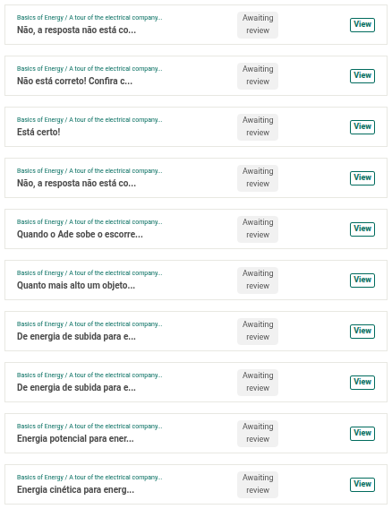 | Concluído |
| 02/11 | Recebimento dos comentários de revisão das traduções submetidas na Sprint 3 (em par com [Nathan Abreu](https://github.com/nateejpg)). | Tradução | [Ver Imagem](./imagens/sprint4_correcao.png)   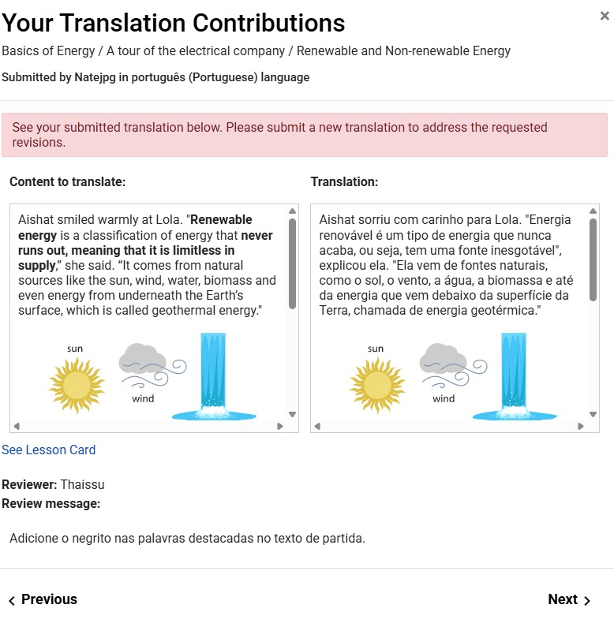 | Concluído |

### Maiores Avanços

* **Alto volume de contribuições em tradução:** Até o momento, em colaboração com [Nathan Abreu](https://github.com/nateejpg), atingimos a marca de **160 traduções realizadas**.
* Finalização do ciclo de revisão das atividades de energias renováveis iniciadas na sprint anterior.
* Manutenção da constância nas atividades da comunidade.

### Maiores Dificuldades

* **Falta de resposta nas issues:** A maior barreira encontrada foi a ausência de retorno dos mantenedores do projeto. Mesmo comentando e solicitando o *assignment* em diversas issues, não obtivemos respostas, o que impediu o início de novas tarefas de código.
* Gerenciar o tempo entre a busca frustrada por issues técnicas e a dedicação necessária para manter o ritmo das traduções.

### Aprendizados

* Aprofundamento na dinâmica de revisão de conteúdo (peer review) dentro da plataforma Oppia.
* Percepção de que a comunicação em projetos open-source grandes pode ser assíncrona e demorada, exigindo persistência na busca por tarefas.

### Plano Pessoal para a Próxima Sprint

* [ ] Insistir na comunicação nas issues já comentadas ou buscar novas frentes de trabalho para conseguir uma tarefa de código.
* [ ] Monitorar a aprovação final das 160 traduções enviadas.

-----

## Sprint 5 – [06/11 – 17/11]

### Resumo da Sprint

O foco desta sprint foi converter o esforço contínuo em contribuições concretas. Enquanto aguardávamos o retorno sobre as submissões anteriores, dedicamos nosso tempo para expandir significativamente a cobertura de tradução da plataforma, abrangendo lições completas de Geometria e Narrativa. Apesar da intenção de avançar em *issues* de código, o período foi majoritariamente dedicado à tradução devido aos bloqueios externos de revisão.

### Atividades Realizadas

| Data | Atividade | Tipo (Código/Doc/Discussão/Outro) | Link/Referência | Status |
| :--- | :--- | :--- | :--- | :--- |
| 06/11 – 17/11 | Espera das correções nas traduções enviadas anteriormente. | Tradução | - | Em Andamento |
| 06/11 – 17/11 | Realização de 80 novas traduções nas lições "Geometry: Shapes, Perimeters and Areas", "Zara at the Animal Shelter" e "Measuring the Area of Shapes" (em par com [Nathan Abreu](https://github.com/nateejpg)). | Tradução | [Ver Imagem](./imagens/sprint5_traducoes.png)   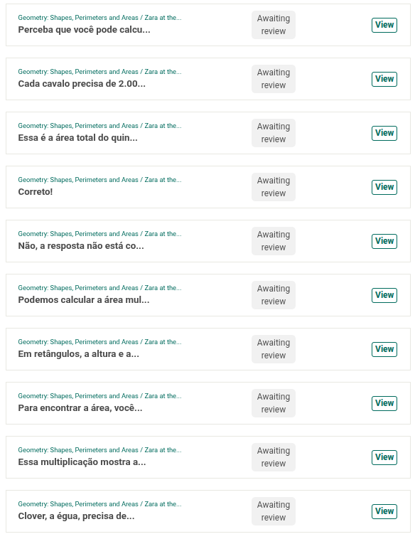 | Concluído |

### Maiores Avanços

* **Expansão do domínio de conteúdo:** Concluímos um pacote robusto de **160 novas traduções** focadas em tópicos de Geometria e Storytelling ("Zara at the Animal Shelter"), mantendo a produtividade em par com [Nathan Abreu](https://github.com/nateejpg).
* **Consistência na contribuição:** Mesmo sem o feedback imediato da comunidade sobre as traduções anteriores, conseguimos manter o ritmo de trabalho abrindo novas frentes de tradução em lições diferentes.

### Maiores Dificuldades

* **Demora na correção das traduções:** O fluxo de revisão da comunidade continua lento. A espera pelo feedback dos revisores se estendeu por toda a sprint, criando um gargalo que impede a finalização (merge) das contribuições já enviadas.
* **Dificuldade em conseguir *assignment* em issues:** Persiste a dificuldade em encontrar tarefas de código disponíveis e, principalmente, obter a designação oficial (*assign*) para elas. A falta de resposta dos mantenedores nas issues comentadas bloqueia o início do trabalho técnico de engenharia.

### Aprendizados

* **Gestão de fluxo assíncrono:** Aprendi a lidar melhor com a ansiedade da "espera", entendendo que em projetos open-source globais é necessário ter múltiplas frentes de trabalho abertas para não ficar ocioso enquanto aguarda revisões.

### Plano Pessoal para a Próxima Sprint

* [ ] Atuar ativamente nas correções assim que o feedback das traduções for liberado.

---

## Sprint 6 – [21/11 – 03/12]

### Resumo da Sprint

Nesta última sprint, consolidamos nossa estratégia de atuação no projeto. Diante dos contínuos bloqueios burocráticos para a atribuição de *issues* de código, migramos a força de trabalho para a tradução de lições, uma área que permitiu contribuição constante e de alto impacto. Focamos no conteúdo de "Higiene e Doenças", garantindo a entrega de um material educativo essencial. Paralelamente, mantivemos a postura técnica proativa: investigamos a *issue* #23905 e solicitamos o *assignment* com a solução já encaminhada, fechando o ciclo da disciplina com entregas robustas tanto em conteúdo quanto em investigação de engenharia.

### Atividades Realizadas

| Data | Atividade | Tipo (Código/Doc/Discussão/Outro) | Link/Referência | Status |
| :--- | :--- | :--- | :--- | :--- |
| 21/11 – 02/12 | Tradução de lições do Oppia ("Hygiene and Diseases - Mostafa Visits the Hospital!") | Tradução | [Ver Imagem](./imagens/teste_sprint6.png)   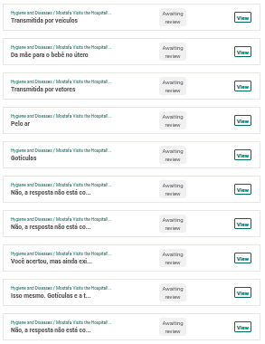 | Aguardando revisão |
| 25/11 | Resolução local e solicitação de *assignment* na issue #23905 | Issue | [Link da Issue](https://github.com/oppia/oppia/issues/23905)   [Ver Imagem](./imagens/sprint6.png)   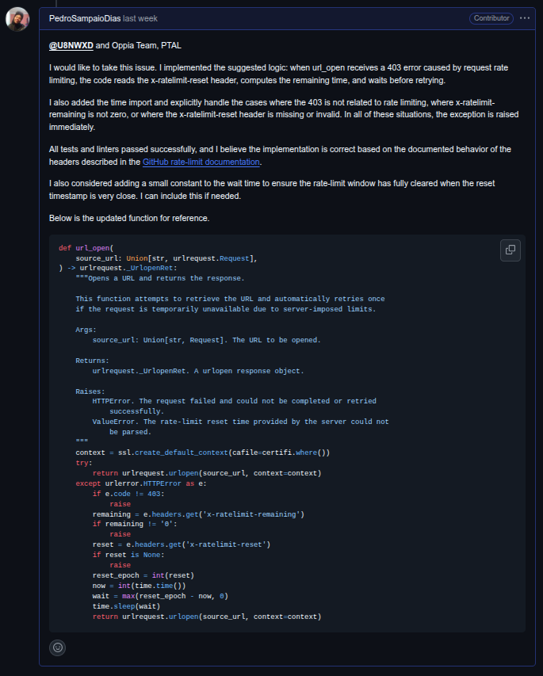 | Aguardando *assigned* |

### Maiores Avanços

* **Marco de Contribuição:** Ao somar os esforços desta etapa final com as sprints anteriores, atingimos a marca expressiva traduções submetidas ao projeto Oppia ao longo do semestre.
* **Consistência Educacional:** Finalização da tradução da lição "Hygiene and Diseases", desenvolvendo uma consistência terminológica importante para materiais de saúde voltados ao público infantil.
* **Engenharia Reversa e Debugging:** Sucesso na reprodução e correção local do *bug* relatado na issue #23905, provando a capacidade técnica de contribuir com o código.

### Maiores Dificuldades

* **Bloqueio na Issue #23905:** A maior frustração técnica foi a impossibilidade de submeter o código. Mesmo com a solução do problema já investigada e praticamente pronta em ambiente local, não obtive a designação oficial (*assignment*) por parte dos mantenedores. Isso impediu a abertura do Pull Request, deixando o trabalho de engenharia travado por questões de permissão.
* **Demora na revisão das traduções:** O fluxo de aprovação da comunidade não acompanhou o ritmo de produção. Há um grande acúmulo de traduções submetidas aguardando feedback dos revisores, o que posterga a integração final do conteúdo.
* **Volume de Conteúdo:** A lição desta sprint continha um alto volume de textos detalhados e termos específicos, exigindo um tempo maior de pesquisa.

### Aprendizados

* **Adaptação de Linguagem:** A tradução de temas sensíveis (como doenças e higiene) para crianças exige um equilíbrio delicado entre precisão técnica e suavidade na linguagem, algo que exercitamos profundamente nesta sprint.

### Observação

Embora a disciplina se encerre nesta data, mantenho o compromisso com a qualidade das contribuições enviadas. Pretendo acompanhar o processo de revisão e realizar as correções necessárias nas traduções pendentes assim que o feedback da comunidade for liberado, garantindo que o material seja efetivamente integrado à plataforma.

---

## Resumo das contribuições individuais

Durante o semestre, minha atuação no projeto Oppia dividiu-se entre engenharia de software (código) e internacionalização (conteúdo), totalizando um impacto significativo na plataforma:

* **Contribuição de Código (Merged):** Autoria e aprovação do **Pull Request #23560**, que corrigiu problemas de resolução em imagens do blog do projeto.
* **Investigação Técnica:** Realizei a engenharia reversa, reprodução local e correção do bug reportado na **Issue #23905**. A solução está pronta em ambiente local, aguardando apenas a permissão burocrática (*assign*) para abertura do PR.
* **Internacionalização (Tradução):** Em colaboração com a equipe, atingi a marca de pelo menos **300 traduções submetidas**. Trabalhei em lições críticas abrangendo diversos temas:
    * *Ciências:* "Renewable and Non-renewable Energy", "Basics of Energy".
    * *Matemática:* "Geometry: Shapes, Perimeters and Areas", "Measuring the Area of Shapes".
    * *Saúde:* "Hygiene and Diseases - Mostafa Visits the Hospital!".
    * *Narrativa:* "Zara at the Animal Shelter".

## Dificuldades Gerais no Projeto

A experiência de contribuir para um projeto *open-source* de grande escala como o Oppia apresentou desafios que foram além da complexidade técnica do código:

* **Rigidez e Instabilidade do Pipeline (CI/CD):** Um dos maiores entraves técnicos foi a execução dos processos de verificação automática. Os *pre-commit hooks* e as checagens de *pre-merge* são extremamente lentos e, muitas vezes, apresentaram bugs internos que não estavam relacionados às nossas alterações. A instabilidade dessa infraestrutura é notória, evidenciada pela grande quantidade de *issues* abertas no repositório oficial relatando problemas apenas no CI (Integração Contínua), o que tornava o fluxo de desenvolvimento frustrante e demorado.
* **Barreira de Entrada Burocrática (Assignment):** A maior dificuldade organizacional foi o processo de atribuição de tarefas (*assign*). A política do projeto exige uma designação formal antes de qualquer submissão de código. Contudo, a comunicação com os mantenedores foi lenta e, muitas vezes, inexistente, o que travou o desenvolvimento de soluções técnicas que já havíamos mapeado ou até resolvido localmente.
* **Gargalo no Fluxo de Revisão:** Houve um descompasso claro entre a velocidade de contribuição dos alunos da disciplina de GCES e a capacidade de revisão da comunidade Oppia. O alto volume de submissões simultâneas gerou um grande *backlog*, fazendo com que traduções e códigos ficassem semanas parados aguardando feedback.
* **Desafios de Infraestrutura Local:** A execução do ambiente de desenvolvimento do Oppia revelou-se extremamente pesada. Mesmo em uma máquina com 16GB de RAM, enfrentei travamentos frequentes e reinicializações forçadas durante a execução dos testes e do servidor local.

## Conclusão

A participação no projeto Oppia ao longo da disciplina de GCES foi uma experiência imersiva na realidade do desenvolvimento de software livre em larga escala. Para além das linhas de código e das traduções realizadas, o maior aprendizado residiu na compreensão de que a engenharia de software envolve, necessariamente, processos rigorosos de comunicação, documentação e paciência.

Apesar das frustrações com a burocracia para obtenção de *issues* e a instabilidade do ambiente de CI/CD, consegui adaptar minha estratégia de contribuição, migrando esforços para a internacionalização para garantir entregas constantes e de valor social. Encerro a disciplina com um saldo positivo de mais de 300 contribuições de conteúdo, um Pull Request de código aprovado. Mantenho o compromisso de acompanhar a integração final das pendências, garantindo que o esforço do semestre se traduza em impacto real para os usuários da plataforma.
